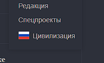
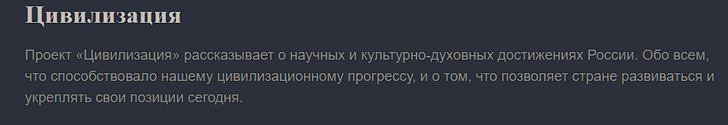
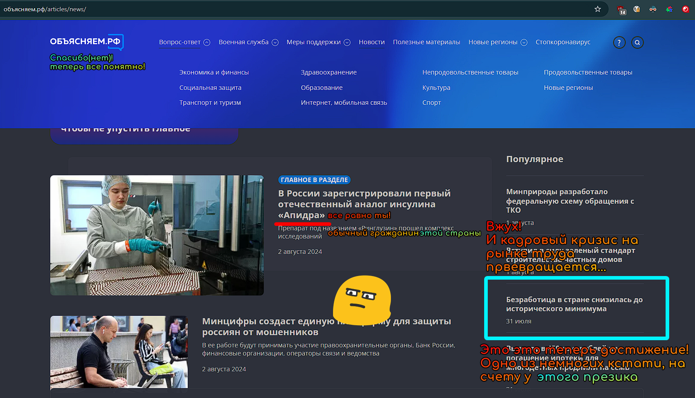
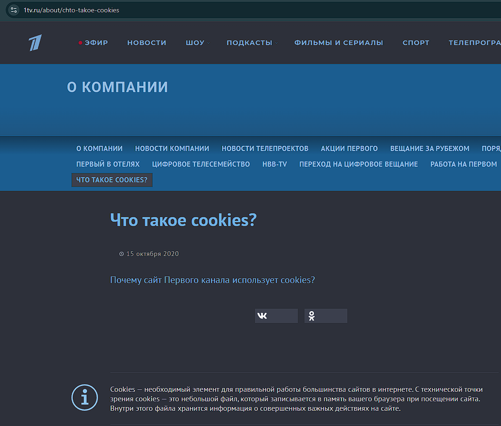
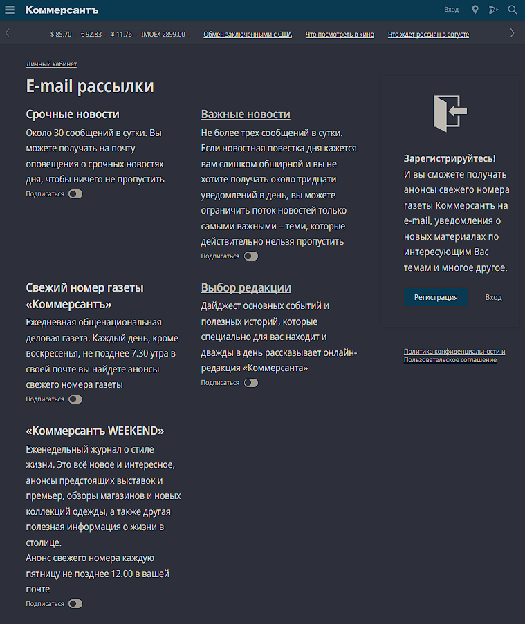
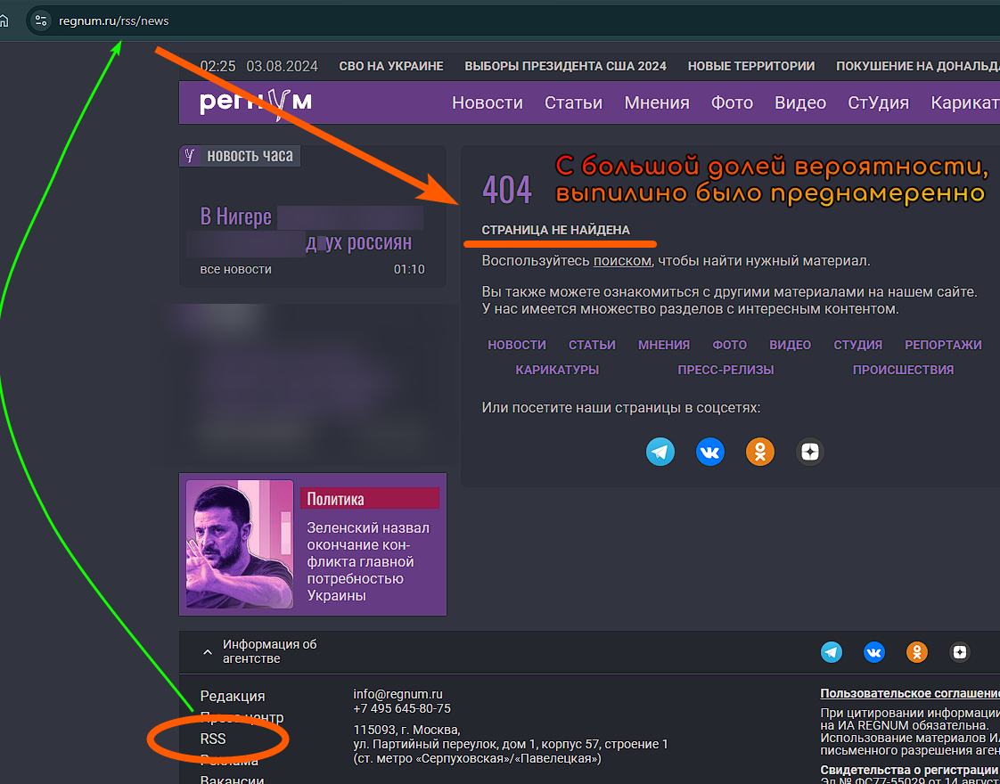

## Прецедент

Не хотелось верить, что необразованным додикам хватит невежества полезть на Youtube. Но пожалуй, это мои любимые грабли  
>"_Никогда нельзя недооценивать предсказуемость тупизны_".  

И вот, **it's happening**, третий день трубе плохо и не грузятся видео.



_Эта страна_ стала на шаг ближе к чебурнету, т.к весь траффик пропускается через [DeepPacketInspector](https://ru.wikipedia.org/wiki/Deep_packet_inspection), аналогично [Great Firewall (англ. вики)](https://en.wikipedia.org/wiki/Great_Firewall#Active_filtering)


Можно попробовать пару утилит, но гарантий никаких. На некоторых провайдерах может и не взлететь.
Мне помогла [эта](https://github.com/ValdikSS/GoodbyeDPI).


Перспектива лишиться "_тытрубы_", лично меня, крайне не радует и сильно беспокоит.  
Остаться без привычного источника новостей цивилизованного мира, бесит и пугает одновременно. Но беспокойство вызывает больше другое.
Это только начало. Статья на вики, явно дает понять, что китайский брат еще многому может научить. Скоро и ВПН не останется в стороне.
Китайская практика, но с другой стороны, показывает, что сколь технологичней анальное зондирование не становилось, китайцев это не смогло остановить и пока им удается обходить блокировки. Но рядовым обывателям от этого не проще.

## Прогноз

При всем желании, ++сделать++ свой **_"суверенный ~~ютаб~~ былибыли[^bb]"_**, у _этого гос-ва_, закономерно не вышло и google доминирует в этом сегменте рынка. Возможно, этот факт и берег детище гугла все это время от банхаммеров, блокировок И буллинга со стороны **Роскомпозора**. Не смотря на то что он всегда был поперек горла _этой власти_.
И что будет, **когда** _это гос-во_ переварит, без особых препятствий и ощутимых негативных последствий, доминирующего игрока рынка?
Внезапно, **_суверенный чебурнет_ и _кибер_-_гулаг_** оказался на пороге. Может преувеличение, однако темпы строительства _анального огорода_ для чебурашки, маловероятно останутся прежними. Риск стал настолько осязаемым и не столь далекими, что вероятность проснуться в совсем _другом гов-не_ стала вопросом времени.  
И вопреки некоторым заявлениям/уверениям (а по сути влажным фантазиям),  не будет _как в "братском" Китае_, c [GFW](https://en.wikipedia.org/wiki/Great_Firewall), [Алибабой](https://ru.wikipedia.org/wiki/Alibaba_Group), [WeChat](https://ru.wikipedia.org/wiki/WeChat), [Weibo](https://ru.wikipedia.org/wiki/Sina_Weibo), [Baidu](https://ru.wikipedia.org/wiki/Baidu) и другими атрибутами цивилизации. В чем наглядно, _это гос-во_, уже **дважды убедилось на практике**, вроде бы, да?:

1) Rutube изначально мертворожденный. И стабильность при нем.
2) ВК новый контент выпускают 3.5 недалеких пропагандона, выставленных из цивилизованных мест. Но это не точно. :kappa:

И вообще такие сравнения не уместны, совсем. КНР и _это гов-но_, абсолютно ++несопоставимы++, причем по всем параметрам.[^comp]
Но если **очень хочется**, то с натяжкой и оговорками, можно _примерить_ Серверную Корею или Туркменистан, но релевантность к будущему _этого гос-ва_ крайне сомнительна.
Чего эти филистеры хотят добиться, очередным выпадом, по большому счету, в сторону своего же народа,УУ остается загадкой. Но у таких действий определенно будут последствия.

## Последствия


Тотальная зачистка информационного поля от независимого спикеров, откроют дверку в _самые токсичные_ времена.
И то ли еще будет, учитывая как это отразилось на возрастном поколении[^old] (++субъективно++: начала проглядываться **_педерастическая риторика_**[^gay] разной степени мерзости).
И сильнее настораживает, что в своем поколении "_ватные приступы_" и симптомы **_той риторики_** случаются все чаще. В т.ч. у людей осознанно невзаимодействующих с пропагандой.


**Как самому не поехать кукухой в таких условиях?**.  


Что-то мне подсказывает что привычная стратегия _голову в песок_, _побег в себя, отрицание, абстрагирование_ и т.п. может привести к неожиданным(и нежелательным) последствиям.
_Например_: Проспать вторую волну мобилизации, когда больше не осталось независимых от гос-ва и публичных спикеров, не то чтобы легко, а ++пиздец как легко++.


dem come for the rasta and you say nothing
dem come for the muslims you say nothing
dem come for the anti-globalist you ay nothing
dem come for the liberals and you say nothing
dem come for you and who will speak for you?
who will speak for you?


## План

Блок youtube оказался неожиданностью и потребовал неотложной рефлексии на тему "_А что если?_".
Которая привела к осознанию, **внезапно** простой, но не всегда очевидной мысли - пропаганда тоже информативна, а порой "_красноречива_", а значит ее можно использовать..
К тому же про нее можно быть уверенным:

- Никуда не денется (при текущей власти), т.е. надежность!
- Материалы повестки стабильно из вторых рук (после п*скова), то есть это ближайшее к власти пуб. раб.
- Да, считывание посыла не всегда тривиально, но при должном внимании и сноровке, не должно быть сложным

Например, с случае youtube, беглый анализ заголовков новостной сводки показал:

- за 2 дня до: Новости начали форсить требовательного характера ,
- за 1: В ход пошли неявные, но очевидные угрозы и обидки потом угрозы, и
- И только на след. день реализация угроз.

ИЧСХ, в присущей **педерастической манере**, не беря ответственности. Хуже террориста.
> Мы вас 3 просили и угрожали... но мы не блокировали. Там просто оборудование давно не меняли в нашем сегменте.  

Решил посматривать за происходящим по ту сторону рассудка в общем.
Стоит отметить, царящую аморальность в гос-ной гандон-фабуле.
Даже с холодной головой и полным сознанием что в объективности, пропагандонские высеры имеют гораздо больше общего с _яойными фанфиками[^yaoi]_, чем с журналистикой.
Некоторые вещи сложно читать/лицезреть все же, просто мерзостно.

На фоне этого вспомнил просто старую технологию RSS, которая позволяет собрать различные потоки информации, в одном месте, подробнее в . Там же можно найти файл пропагандоского ленты.
Собрал если не все, то подавляющее большинство точно, а это набежавшее за пару дней.


Если не заленюсь/забуду можно будет посчитать процент кальки в болоте. Да и вообще рассмотреть со стороны статистических данных.
На глаз и по субъективному, крайне много. Но глазам верить это такое себе.
По итогу РСС оказался к месту. Теперь на _метаанализ_ новостной сводки, делается буквально по заголовкам и не занимает много времени.
С таким можно работать.

## Bonus

Пока собирал ленту, пришлось познакомиться с сайтами первой десятки страниц выдачи гугла, по запросу "_новости России_".
Хочется поделиться отборными находками из зазеркалья. Аж в двух частях.

### Префронтальная на орбите

1. Открывает выставку <https://iz.ru>
    
2. <https://gazeta.ru/>
    
    Оксюморон, неплохо! Видать не все журналистское атрофировалось еще!
    
    а еще там смешная инфографика)
    

3. Чет кекнул в голос с этого.
    
    
4. <https://vz.ru> "_Взгляд как бы намекающий!_" :joy:
    
    
5. Больше всего конечно удивило отсутствие RSS на некоторых ресурсах. Хотя казалось бы, технология не сложная и сделана специально в угоду простоты распространения инфы.
    Среди отсталышей например:
    - <https://www.mk.ru/news/>
    - <https://www.vesti.ru/>
    - <https://www.1tv.ru/>  
    - <https://www.kommersant.ru/> зато можно подписаться! 
6. RSS таки есть, но в разметке(коде) т.е. на странице не отображается:
<https://www.vedomosti.ru/>
<https://rtvi.com>
<https://newizv.ru/>
<https://news.ru/rss/> не работает в придачу
<https://regnum.ru/> удален, но не удален. 

### Кот писал код

Вторая бонусная часть, техническая
Были конечно подозрения что там все очень плохо, но что бы настолько. Небольшая часть сайтов является SPA(Single Page Application), что насколько мне известно, не очень хорошая практика для SEO. Но я не самый опытный фронтендер, так что тут Санек меня поправит если что.

1. Оптимизация? Неее 
2. Кому вебкит, а кому... 
3. Оставлять комменты в продакшене по определению очень скверная практика 
4. А то мало ли кто обнаружит твое русофобское говно 
5. мммм, запросы в бд 
6. Практически все сайты максимально плевали на приватность и крайне агрессивно рассылают инфу о каждом клике пользователя в лучшем случае 3 разным сборщикам метрик 

### Напоследок Наглядно

Не знаю зачем и как к этому вообще можно было придти, но на некоторых ресурсах, в футере рядом с информацией о лицензии новостного медиа
Так же выложены перечни террористов и иностранных агентов, причем одной строчкой, лол.
Решил слегка отформатировать его, заодно ознакомиться.
И тут тоже нашлось с чего посмеяться, написал комменты по некоторым позициям.
Сразу становится очевидно какие у _этой страны_ **враги** и с чем она борется на деньги **честных налогоплательщиков**.



ТЕРРОРИСТИЧЕСКОЕ СООБЩЕСТВО АЙДАР;
БАДЕНДЯ ВЛАДИМИР ПАВЛОВИЧ;
КОЗЛОВА ОЛЬГА БОРИСОВНА;
ЗАЗУЛЯ СЕРГЕЙ;
ШУЛЬГА АНДРЕЙ АЛЕКСАНДРОВИЧ;
САЕНКО ОЛЬГА АЛЕКСАНДРОВНА;
ГУДКОВ ГЕННАДИЙ ВЛАДИМИРОВИЧ;
КУИМОВ ЛЕОНИД АЛЕКСАНДРОВИЧ;
СЛАВИНСКИЙ ДМИТРИЙ СЕРГЕЕВИЧ;
ДУРНОВЦЕВ АНДРЕЙ ФЕДОРОВИЧ;
ГУРКО АЛЕКСАНДР ЗЕНОНОВИЧ;
ШАТАЛОВ СЕРГЕЙ ИГОРЕВИЧ;
ХАНАФИЕВ ИЛЬНАЗ ИЛЬШАТОВИЧ;
БАЛИЦКИЙ ЯРОСЛАВ БРОНИСЛАВОВИЧ;
РЕЗНИК РОМАН ВЯЧЕСЛАВОВИЧ;
РАСТОРГУЕВ ВИТАЛИЙ ВЛАДИМИРОВИЧ;
КРИВЦУН ВЛАДИМИР ВИКТОРОВИЧ;
ФЕВЗИЕВ РАИФ ЭНВЕРОВИЧ;
ДАВЛЕТБАЕВ САЛМАН ИБРАГИМОВИЧ;
ВЕЙШТОРТ БОРИС БОРИСОВИЧ;
КОНДАКОВ ВЛАДИСЛАВ АЛЕКСЕЕВИЧ;
ТАНГИРКУЛОВ СИРОЖ АБДУМАЖИД УГЛИ;
ЦЫМБАЛЮК НИКОЛАЙ ВЛАДИМИРОВИЧ;
ХАМРАЕВ АББОСЖОН КОБИЛКЕК УГЛИ;
БАРАТОВ УСМАН АКРАМОВИЧ;
БОЦИЕВ ВЛАДИМИР АХСАРБЕКОВИЧ;
ВАСИЛЬЕВ ДЕНИС ВИКТОРОВИЧ;
КАБИРКУЛОВ ХАБИБУЛЛО ШАРИФЖОНОВИЧ.


Внезапно славяне террористы.

***



```md
<!-- C первых прям в голос. Что это ирония, постирония или мета? -->
Общество с ограниченной ответственностью «Важные иноагенты»;
Общество с ограниченной ответственностью «Как бы инагент»;
Общество с ограниченной ответственностью «Иноагент ААВ»;
Общество с ограниченной ответственностью «ЖУРНАЛИСТ ИНОСТРАННЫЙ АГЕНТ»;**
Общество с ограниченной ответственностью «Иновещание»;

«Евразийская антимонопольная ассоциация»;
Ассоциация некоммерческих организаций «В защиту прав избирателей «ГОЛОС»;
Региональная общественная правозащитная организация «Союз «Женщины Дона»;
Автономная некоммерческая научно-исследовательская организация «Центр социальной политики и гендерных исследований»;
Региональная общественная организация в защиту демократических прав и свобод «ГОЛОС»;
Некоммерческая организация Фонд «Костромской центр поддержки общественных инициатив»;
Калининградская региональная общественная организация «Экозащита!-Женсовет»;
Фонд содействия защите прав и свобод граждан «Общественный вердикт»;
Межрегиональная общественная организация Правозащитный Центр «Мемориал»;
Автономная некоммерческая организация «Юристы за конституционные права и свободы»;
Межрегиональная Ассоциация правозащитных общественных объединений «Правозащитная ассоциация»;
Санкт-Петербургская региональная общественная правозащитная организация «Солдатские матери Санкт-Петербурга»;
Фонд «Институт Развития Свободы Информации»;
Автономная некоммерческая организация «Научный центр международных исследований «ПИР»;
Ассоциация «Партнерство для развития» (Саратовская региональная общественная благотворительная организация);
Частное учреждение «Информационное агентство МЕМО. РУ»;
Некоммерческое партнерство «Институт региональной прессы»;
Автономная некоммерческая организация «Московская школа гражданского просвещения»;
Архангельская региональная общественная организация социально-психологической и правовой помощи лесбиянкам, геям, бисексуалам и трансгендерам (ЛГБТ) «Ракурс»;
Карачаево-Черкесская Республиканская молодежная общественная организация «Союз молодых политологов»;
Общероссийское общественное движение защиты прав человека «За права человека»;
Краснодарская краевая общественная организация выпускников вузов;
Калининградская региональная общественная организация «Правозащитный центр»;
Региональная общественная организация «Общественная комиссия по сохранению наследия академика Сахарова»;
Санкт-Петербургская правозащитная общественная организация «Лига избирательниц»;
Фонд поддержки свободы прессы;
Санкт-Петербургская общественная правозащитная организация «Гражданский контроль»;
Автономная некоммерческая организация информационных и правовых услуг «Ресурсный правозащитный центр»;
Межрегиональная общественная правозащитная организация «Человек и Закон»;
Автономная некоммерческая организация «Центр социального проектирования «Возрождение»;
Межрегиональная общественная организация «Информационно-просветительский центр «Мемориал»;
<!-- Кляты Иноагенты не имеют права мешать заниматься пытками! -->
Межрегиональная общественная организация «Комитет против пыток»;
«Частное учреждение в СанктПетербурге по административной поддержке реализации программ и проектов Совета Министров северных стран»;
Автономная некоммерческая правозащитная организация «Молодежный центр консультации и тренинга»;
Еврейское областное региональное отделение Общероссийской общественной организации «Муниципальная Академия»;
Некоммерческое партнерство «Институт развития прессы-Сибирь»;
Мурманская региональная общественная организация «Центр социально-психологической помощи и правовой поддержки жертв дискриминации и гомофобии «Максимум»;
Межрегиональный общественный фонд содействия развитию гражданского общества «ГОЛОС – Поволжье»;
Межрегиональная благотворительная общественная организация «Сибирский экологический центр»;
Фонд «Центр гражданского анализа и независимых исследований «ГРАНИ»;
Городская общественная организация «Самарский центр гендерных исследований»;
Региональный Фонд «Центр Защиты Прав Средств Массовой Информации», с 05.12.2023 Фонд "Центр Защиты Прав Средств массовой информации";
Челябинский региональный благотворительный общественный фонд «За природу»;
Челябинское региональное экологическое общественное движение «За природу »;
Общественное региональное движение «Новгородский Женский Парламент»;
Самарская региональная общественная организация содействия гармонизации межнациональных отношений «АЗЕРБАЙДЖАН»;
Мурманская региональная молодежная общественная организация «Гуманистическое движение молодежи»;
Мурманская региональная общественная экологическая организация «Беллона-Мурманск»;
Частное учреждение дополнительного профессионального образования «Учебный центр экологии и безопасности»;
Фонд поддержки социальных проектов «Миграция XXI век»;
Ростовская городская общественная организация «ЭКО-ЛОГИКА»;
Автономная некоммерческая организация «Центр антикоррупционных исследований и инициатив «Трансперенси Интернешнл-Р»;
<!-- Кляты Иноагенты надежда это от лукавого! -->
Озерская городская социально-экологическая общественная организация «Планета надежд»;
Новосибирский областной общественный фонд «Фонд защиты прав потребителей»;
Региональная общественная благотворительная организация помощи беженцам и мигрантам «Гражданское содействие»;
Фонд поддержки расследовательской журналистики – Фонд 19/29;
Калининградская региональная общественная организация информационно-правовых программ «Женская лига»;
Автономная некоммерческая организация «Мемориальный центр истории политических репрессий «Пермь-36»;
Ассоциация «Экспертно-правовое партнерство «Союз»;
Некоммерческое партнерство «Клуб бухгалтеров и аудиторов некоммерческих организаций»;
«Частное учреждение в Калининграде по административной поддержке реализации программ и проектов Совета Министров северных стран»;
Межрегиональная благотворительная общественная организация «Центр развития некоммерческих организаций»;
<!-- Кляты Иноагенты хахаха Права Человека, умоляю! -->
Негосударственное образовательное учреждение дополнительного профессионального образования (повышение квалификации) специалистов «АКАДЕМИЯ ПО ПРАВАМ ЧЕЛОВЕКА»;
Свердловская региональная общественная организация «Сутяжник»;
Нижегородская региональная общественная организация «Экологический центр «Дронт»;
ФОНД НЕКОММЕРЧЕСКИХ ПРОГРАММ ДМИТРИЯ ЗИМИНА «ДИНАСТИЯ»;
НЕКОММЕРЧЕСКАЯ ОРГАНИЗАЦИЯ НАУЧНЫЙ ФОНД ТЕОРЕТИЧЕСКИХ И ПРИКЛАДНЫХ ИССЛЕДОВАНИЙ «ЛИБЕРАЛЬНАЯ МИССИЯ»;
Территориальное объединение работодателей «Ефремовский районный союз промышленников и предпринимателей»;
Региональная общественная организация «Центр независимых исследователей Республики Алтай»;
ФОНД "СИБИРСКИЙ ЦЕНТР ПОДДЕРЖКИ ОБЩЕСТВЕННЫХ ИНИЦИАТИВ";
РЕСПУБЛИКАНСКАЯ МОЛОДЕЖНАЯ ОБЩЕСТВЕННАЯ ОРГАНИЗАЦИЯ «НУОРИ КАРЬЯЛА» («МОЛОДАЯ КАРЕЛИЯ);
МЕЖРЕГИОНАЛЬНЫЙ ОБЩЕСТВЕННЫЙ ФОНД МИРА НА ЮГЕ И СЕВЕРНОМ КАВКАЗЕ;
Автономная некоммерческая организация «Центр независимых социологических исследований»;
Автономная некоммерческая организация «Центр информации «ФРИИНФОРМ»;
Региональная общественная организация содействия охране репродуктивного здоровья граждан «Народонаселение и Развитие»;
Алтайская краевая общественная организация «Геблеровское экологическое общество»;
АССОЦИАЦИЯ «СОДЕЙСТВИЕ В ПРАВОВОЙ ЗАЩИТЕ НАСЕЛЕНИЯ «ПРАВОВАЯ ОСНОВА»;
Межрегиональная общественная организация «Северная природоохранная коалиция»;
КОМИ РЕГИОНАЛЬНАЯ ОБЩЕСТВЕННАЯ ОРГАНИЗАЦИЯ «КОМИССИЯ ПО ЗАЩИТЕ ПРАВ ЧЕЛОВЕКА «МЕМОРИАЛ»;
Алтайский краевой эколого-культурный общественный фонд «Алтай-21век»;
МЕЖРЕГИОНАЛЬНЫЙ ОБЩЕСТВЕННЫЙ ФОНД СОДЕЙСТВИЯ РАЗВИТИЮ ГРАЖДАНСКОГО ОБЩЕСТВА «ГОЛОС – УРАЛ»;
ФОНД ПОДДЕРЖКИ СРЕДСТВ МАССОВОЙ ИНФОРМАЦИИ «СРЕДА»;
Нижегородская областная социально-экологическая общественная организация «Зеленый мир»;
ФОНД «ГРАЖДАНСКОЕ ДЕЙСТВИЕ»;
Некоммерческое партнерство «Альянс фондов местных сообществ Пермского края»;
Кабардино-Балкарский республиканский общественный правозащитный центр Региональное отделение Общероссийского общественного движения «За права человека»;
ЧЕЧЕНСКАЯ РЕГИОНАЛЬНАЯ ОБЩЕСТВЕННАЯ ОРГАНИЗАЦИЯ «ПРАВОЗАЩИТНЫЙ ЦЕНТР ЧЕЧЕНСКОЙ РЕСПУБЛИКИ»;
Межрегиональный общественный экологический фонд «ИСАР-СИБИРЬ»;
ОБЩЕСТВЕННАЯ ОРГАНИЗАЦИЯ «ПЕРМСКИЙ РЕГИОНАЛЬНЫЙ ПРАВОЗАЩИТНЫЙ ЦЕНТР»;
Региональная общественная организация по улучшению качества жизни общества «Сибирская линия жизни»;
Фонд в поддержку демократии «ГОЛОС»;
Региональная общественная организация «Еврейский общинный культурный центр Рязанской области «Хесед-Тшува»;
Региональная общественная организация «Экологическая вахта Сахалина»;
Автономная некоммерческая организация «Информационно-исследовательский центр «Ясавэй Манзара»;
Межрегиональная общественная благотворительная организация «Общество защиты прав потребителей и охраны окружающей среды «ПРИНЦИПЪ»;
Автономная некоммерческая организация «Дальневосточный центр развития гражданских инициатив и социального партнерства»;
Союз общественных объединений «Российский исследовательский центр по правам человека»;
Фонд содействия развитию гражданского общества и правам человека «Женщины Дона»;
Красноярское региональное экологическое общественное движение «Друзья сибирских лесов»;
Омская городская общественная организация «Фото-клуб «Со-бытие»;
Региональное общественное учреждение научно-информационный центр «МЕМОРИАЛ»;
Иркутская региональная общественная организация «Байкальская Экологическая Волна»;
Некоммерческая организация «Фонд защиты гласности»;
<!-- Кляты Иноагенты хахаха Права Человека, умоляю! -->
Автономная некоммерческая организация «Институт прав человека»;
Межрегиональная общественная организация «Центр содействия коренным малочисленным народам Севера»;
Местная общественная благотворительная экологическая организация Зеленый Мир;
Автономная некоммерческая организация «Правозащитная организация «МАШР»;
Калининградская региональная общественная организация содействия развитию женского сообщества «Мир женщины»;
Региональная общественная организация «Информационно-исследовательский центр «Панорама»;
Забайкальское краевое общественное учреждение «Общественный экологический центр «Даурия»;
Городская общественная организация «Екатеринбургское общество «МЕМОРИАЛ»;
<!-- Кляты Иноагенты не имеют права мешать заниматься пытками! -->
Межрегиональная общественная организация «Комитет по предотвращению пыток»;
Межрегиональная общественная организация «Бюро общественных расследований»;
Нижегородская региональная общественная организация «Институт прогнозирования и урегулирования политических конфликтов»;
Городская общественная организация «Рязанское историко-просветительское и правозащитное общество «Мемориал» (Рязанский Мемориал);
Санкт-Петербургская общественная организация «Общество содействия социальной защите граждан «Петербургская ЭГИДА»;
Челябинский региональный орган общественной самодеятельности – женское общественное объединение «Женщины Евразии»;
Омская региональная общественная организация «Центр охраны здоровья и социальной защиты «СИБАЛЬТ»;
Челябинский региональный орган общественной самодеятельности «Уральская правозащитная группа»;
Челябинский региональный общественный фонд поддержки демократии «Уральский демократический фонд»;
Благотворительный фонд социально-правовой помощи «Сфера»;
Межрегиональная общественная организация «Центр гражданского образования и прав человека»;
Некоммерческая организация Международный Фонд развития коренных малочисленных народов Севера, Сибири и Дальнего Востока «БАТАНИ»;
Автономная некоммерческая организация «Центр социально-трудовых прав»;
Региональная общественная экологическая организация Республики Алтай «Архар»;
Автономная некоммерческая организация «Издательский дом «Валентин Мануйлов»;
Региональная общественная организация «Школа экологии Души «Тенгри»;
Автономная некоммерческая организация «Ганзейское бюро/Информационное бюро земли Шлезвиг-Гольштейн в Калининграде»;
Красноярская региональная общественная организация «Агентство общественных инициатив»;
Саратовская Региональная Общественная Организация «Социум»;
Пермская региональная общественная организация «Пермская гражданская палата»;
Региональная общественная организация Интеграционный центр «Миграция и Закон»;
Некоммерческое партнерство по поддержке социально-профилактических программ в сфере общественного здоровья «ЭСВЕРО»;
Фонд содействия защите здоровья и социальной справедливости имени Андрея Рылькова;
Алтайская региональная спортивно-патриотическая молодежная общественная организация «Арктика»;
<!-- Кляты Иноагенты хахаха свобода, умоляю! -->
Автономная некоммерческая организация «Свободное слово»;
Фонд «Институт экономического анализа»;
Пензенская региональная молодежная общественная организация по профилактике негативных явлений среди молодежи «Панацея»;
Самарская региональная общественная организация «Клуб выпускников американских программ»;
Автономная некоммерческая организация «Издательство «Парк Гагарина»;
Автономная Некоммерческая Организация «Аналитический Центр Юрия Левады»;
Межрегиональная природоохранная и правозащитная общественная организация «Экологическая Вахта по Северному Кавказу»;
Автономная некоммерческая правозащитная организация «Школа призывника»;
Фонд поддержки гражданских свобод «Правовая миссия»;
Международная общественная организация «Международное историко-просветительское, благотворительное и правозащитное общество «Мемориал»;
Свердловский областной общественный Фонд «Эра здоровья»;
Чапаевская городская общественная организация «Ассоциация медицинских работников города Чапаевска»;
Региональный благотворительный фонд «Самарская губерния»;
Ассоциация «Интернет Сообщество»;
Автономная некоммерческая организация социальной поддержки населения «Проект Апрель»;
Региональная общественная организация помощи женщинам и детям, находящимся в кризисной ситуации «Информационно-методический центр «Анна»;
Краснодарская региональная благотворительная общественная организация «Южный правозащитный центр»;
Свердловское отделение Общероссийской общественной организации «Российское историко-просветительское, благотворительное и правозащитное общество «Мемориал»;
Региональная общественная организация содействия просвещению граждан «Информационно-аналитический центр «Сова»;
Свердловская областная общественная организация содействия легальной миграции «Нелегалов.Нет»;
Санкт-Петербургская общественная организация Экологический правозащитный Центр «Беллона»;
Молодежная Общественная Организация Солонешенского района «Про-Движение»;
Калининградское региональное общественное учреждение «Общество немецкой культуры и российских немцев «Айнтрахт Согласие»;
<!-- well, well, well, Кляты Иноагенты! -->
Фонд содействия развитию массовых коммуникаций и правовому просвещению «Так-так-Так»;
Мурманская областная общественная организация «Кольский экологический центр»;
Фонд содействия устойчивому развитию «Серебряная тайга»;
Свердловский региональный общественный фонд социальных проектов «Новое время»;
Краснодарское краевое отделение Общероссийской общественной организации «Российское историко-просветительское и правозащитное общество «Мемориал»;
Архангельская региональная молодежная экологическая общественная организация «Этас»;
Вологодская региональная общественная организация «Культурно-просветительское общество «Полония»;
Общероссийская общественная организация содействия развитию автомобильных перевозок «Объединение Перевозчиков России»;
«Голос Америки»;
«Idel.Реалии»;
Кавказ.Реалии;
Крым.Реалии;
Телеканал Настоящее Время;
Татаро-башкирская служба Радио Свобода (Azatliq Radiosi);
Радио Свободная Европа/Радио Свобода (PCE/PC);
«Сибирь.Реалии»;
«Фактограф»;
Алтайская краевая общественная просветительская организация в сфере охраны здоровья «Выбор»;
Алтайское краевое общественное движение поддержки гражданских и социальных инициатив «Согласие»;
Городской благотворительный фонд «Фонд Тольятти»;
Фонд «Институт экономических и социальных исследований»;
Саратовское региональное отделение межрегиональной общественной организации «Евро-Азиатское геофизическое общество»;
Благотворительный фонд помощи осужденным и их семьям;
Благотворительный фонд охраны здоровья и защиты прав граждан;
Челябинское региональное диабетическое общественное движение «ВМЕСТЕ»;
Автономная некоммерческая организация по оказанию услуг в области защиты прав человека «Молодежная правозащитная группа»;
Автономная некоммерческая организация противодействия эпидемии ВИЧ/СПИДа и охраны здоровья социально-уязвимых групп населения «Центр социально-информационных инициатив Действие»;
Автономная некоммерческая организация «Институт глобализации и социальных движений»;
Общероссийское общественное движение защиты прав человека «За права человека»;
Фонд «В защиту прав заключенных»;
Региональная общественная организация содействия соблюдению прав человека «Горячая линия»;
Частное учреждение «Центр поддержки и содействия развитию средств массовой информации»;
Общественная организация «Саратовский областной еврейский благотворительный центр «Хасдей Ерушалаим» (Милосердие);
Ингушское республиканское отделение Общероссийской общественной организации «Российский Красный Крест»;
<!-- болезни Кляты Иноагентов россиянин не может таким болеть! -->
Саратовская региональная общественная организация инвалидов, больных сахарным диабетом;
Пензенский региональный общественный благотворительный фонд «Гражданский союз»;
Некоммерческая организация «Фонд борьбы с коррупцией»;
Ингушская региональная общественная организация «Институт социальных изменений»;
Автономная некоммерческая организация информационных и правовых услуг «Гражданская инициатива против экологической преступности»;
«Север.Реалии»;
Фонд «Общественный фонд социального развития «Генезис»;
Некоммерческая организация Фонд «Правовая инициатива»;
Общество с ограниченной ответственностью «Радио Свободная Европа/Радио Свобода»;
Автономная некоммерческая организация Центр развития социальных инициатив «Проектория»;
Фонд содействия правовому просвещению населения «Лига Избирателей»;
Санкт-Петербургский благотворительный фонд «Гуманитарное действие»;
Социально-ориентированная автономная некоммерческая организация содействия профилактике и охране здоровья граждан «Феникс плюс»;
Межрегиональная общественная организация реализации социально-просветительских инициатив и образовательных проектов «Открытый Петербург»;
Автономная некоммерческая организация социально-правовых услуг «Акцент»;
Чешское информационное агентство «MEDIUM-ORIENT»;
Некоммерческая организация «Фонд защиты прав граждан»;
Программно-целевой Благотворительный Фонд «СВЕЧА»;
<!-- болезни Кляты Иноагентов россиянин не может таким болеть! -->
Красноярская региональная общественная организация «Мы против СПИДа»;
Апахончич Дарья Александровна;
Камалягин Денис Николаевич;
Маркелов Сергей Евгеньевич;
Пономарев Лев Александрович;
Савицкая Людмила Алексеевна;
<!-- Кляты Иноагенты НАСИЛИЮ.ДА! -->
Автономная некоммерческая организация «Центр по работе с проблемой насилия «НАСИЛИЮ.НЕТ»;
<!-- Кляты Иноагенты врачи тоже от лукавого, русские не болеют! -->
Межрегиональный профессиональный союз работников здравоохранения «Альянс врачей»;
Юридическое лицо, зарегистрированное в Латвийской Республике, SIA «Medusa Project» (регистрационный номер 40103797863, дата регистрации 10.06.2014);
Общество с ограниченной ответственностью «Первое антикоррупционное СМИ»;
Некоммерческая организация «Фонд по борьбе с коррупцией»;
Юридическое лицо, зарегистрированное в Королевстве Нидерландов, Stichting 2 Oktober (регистрационный номер № 69126968), являющееся администратором доменного имени интернет-ресурса «VTimes.io»;
Автономная некоммерческая организация по содействию распространению современных образовательных программ «Лаборатория социальных наук»;
Автономная некоммерческая организация «Институт права и публичной политики»;
Баданин Роман Сергеевич;
Гликин Максим Александрович;
Железнова Мария Михайловна;
Лукьянова Юлия Сергеевна;
Маетная Елизавета Витальевна;
Маняхин Петр Борисович;
Чуракова Ольга Владимировна;
Ярош Юлия Петровна;
Апухтина Юлия Владимировна;
Некоммерческая организация «Фонд защиты прав граждан «Штаб»;
Юридическое лицо «The Insider SIA», зарегистрированное в Риге, Латвийская Республика (дата регистрации 26.06.2015), являющееся администратором доменного имени интернет-издания «The Insider SIA», https://theins.ru;
Гройсман Софья Романовна;
Постернак Алексей Евгеньевич;
Рождественский Илья Дмитриевич;
Рубин Михаил Аркадьевич;
Общероссийское общественное движение в защиту прав избирателей "Голос";
Анин Роман Александрович;
Пермская региональная общественная организация поддержки и развития медиа-проектов «Четвертый сектор»;
Юридическое лицо Istories fonds, зарегистрированное в Латвийской Республике (регистрационный номер 50008295751, дата регистрации 24.02.2020);
Великовский Дмитрий Александрович;
Долинина Ирина Николаевна;
Мароховская Алеся Алексеевна;
Петров Степан Юрьевич;
Общество с ограниченной ответственностью Телеканал Дождь;
Шлейнов Роман Юрьевич;
Шмагун Олеся Валентиновна;
Общество с ограниченной ответственностью «Альтаир 2021»;
Общество с ограниченной ответственностью «Вега 2021»;
Общество с ограниченной ответственностью «Главный редактор 2021»;
Общество с ограниченной ответственностью «Ромашки монолит»;
Важенков Артем Валерьевич;
Верзилов Петр Юрьевич;
Ивановская областная общественная организация «Центр гендерных исследований»;
Автономная некоммерческая организация «Нижегородский центр немецкой и европейской культуры»;
Грезев Александр Викторович;
Гурман Юрий Альбертович;
Гусев Андрей Юрьевич;
Медиапроект "ОВД-Инфо";
Егоров Владимир Владимирович;
Жилинский Владимир Александрович;
Жилкин Владимир Владимирович;
Общество с ограниченной ответственностью «Зона права»;
Общество с ограниченной ответственностью «ЗП»;
Иванова София Юрьевна;
Карезина Инна Павловна;
Каткова Вероника Вячеславовна;
Кильтау Екатерина Викторовна;
Ковин Виталий Сергеевич;
Костылева Полина Владимировна;
Кузьмина Людмила Гавриловна;
Любарев Аркадий Ефимович;
Лютов Александр Иванович;
Петров Алексей Викторович;
Пигалкин Илья Валерьевич;
Пискунов Сергей Евгеньевич;
Смирнов Сергей Сергеевич;
Тихонов Михаил Сергеевич;
Арапова Галина Юрьевна;
Вольтская Татьяна Анатольевна;
Американская компания «Mason G.E.S. Anonymous Foundation» (США), являющаяся владельцем интернетиздания https://mnews.world/;
Компания «Stichting Bellingcat», зарегистрированная в Нидерландах (дата регистрации 11.07.2018);
Захаров Андрей Вячеславович;
Клепиковская Екатерина Дмитриевна;
Общество с ограниченной ответственностью «МЕМО»;
Перл Роман Александрович;
Симонов Евгений Алексеевич;
Соловьева Елена Анатольевна;
Сотников Даниил Владимирович;
Сурначева Елизавета Дмитриевна;
<!-- Кляты Иноагенты хахаха Ваше мнение тут никого не волнует, умоляю! -->
Автономная некоммерческая организация по защите прав человека и информированию населения «Якутия – Наше Мнение»;
Акционерное общество «РС-Балт»;
Общество с ограниченной ответственностью «Москоу диджитал медиа», с 26.01.2023 Общество с ограниченной ответственностью «Чайка Белые сады»;
Ветошкина Валерия Валерьевна;
Заговора Максим Александрович;
Межрегиональное общественное движение "Российская ЛГБТ - сеть";
Оленичев Максим Владимирович;
Павлов Иван Юрьевич;
Скворцова Елена Сергеевна;
Кочетков Игорь Викторович;
<!-- Кляты Иноагенты хахаха Честные выборы, умоляю! -->
Общество с ограниченной ответственностью «Честные выборы»;
Фонд развития книжной культуры «Иркутский союз библиофилов»;
Еланчик Олег Александрович;
Общество с ограниченной ответственностью «Нобелевский призыв»;
Гималова Регина Эмилевна;
Григорьев Андрей Валерьевич;
Григорьева Алина Александровна;
Ассоциация по содействию защите прав призывников, альтернативнослужащих и военнослужащих "Правозащитная группа "Гражданин.Армия.Право";
Хисамова Регина Фаритовна;
Автономная некоммерческая организация по реализации социальноправовых программ "Лилит";
Дальневосточное общественное движение "Маяк";
Санкт-Петербургская ЛГБТинициативная группа "Выход";
Инициативная группа ЛГБТ+ "Реверс";
Алексеев Андрей Викторович;
Бекбулатова Таисия Львовна;
Беляев Иван Михайлович;
Владыкина Елена Сергеевна;
Гельман Марат Александрович;
Никульшина Вероника Юрьевна;
Толоконникова Надежда Андреевна;
Шендерович Виктор Анатольевич;
<!-- lmao -->
Общество с ограниченной ответственностью «Данное сообщение»;
Общество с ограниченной ответственностью «Номер семьдесят семь»;
Общество с ограниченной ответственностью Издательский дом «Новая глава»;
Общество с ограниченной ответственностью «ЛПНМ»;
Региональная национально-культурная общественная организация "Туба калык" (Тубалары);
Айнбиндер Александра Александровна;
Московский комьюнити-центр для ЛГБТ+инициатив;
Общество с ограниченной ответственностью «Новогодний выпуск»;
Общество с ограниченной ответственностью «Процесс 2021»;
Автономная некоммерческая организация "Друзья Балтики";
<!-- Один мой друг оттуда ಠ_ಠ -->
Автономная некоммерческая организация для издания научнопопулярной газеты "ТРОИЦКИЙ ВАРИАНТ-НАУКА";
Благотворительный фонд развития филантропии;
Deutsche Welle (Германия, KurtSchumacher-Strasse 3, 53113 Bonn);
Борзунова Мария Михайловна;
Воробьев Виктор Викторович;
Голубева Анна Львовна;
Константинова Алла Михайловна;
Малкова Ирина Владимировна;
Мурадов Мурад Абдулгалимович;
Осетинская Елизавета Николаевна;
Понасенков Евгений Николаевич;
Ганапольский Матвей Юрьевич;
Киселев Евгений Алексеевич;
Борухович Ирина Григорьевна;
Дремин Иван Тимофеевич;
Дубровский Дмитрий Викторович;
Красноярская региональная общественная организация поддержки и развития альтернативных образовательных технологий и межкультурных коммуникаций "ИНТЕРРА";
Маяковская Екатерина Алексеевна;
Фейгин Марк Захарович;
Филимонов Андрей Викторович;
Дзугкоева Регина Николаевна;
Доброхотов Роман Александрович;
Дудь Юрий Александрович;
Елкин Сергей Владимирович;
Кругликов Кирилл Игоревич;
Сабунаева Мария Леонидовна;
Семенов Алексей Владимирович;
Шаинян Карен Багратович;
Шульман Екатерина Михайловна;
Асафьев Артур Валерьевич;
Вахштайн Виктор Семенович;
Венедиктов Алексей Алексеевич;
Воронов Владимир Владимирович;
Лушникова Екатерина Евгеньевна;
Волков Леонид Михайлович;
Невзоров Александр Глебович;
Пархоменко Сергей Борисович;
Сироткин Ярослав Николаевич;
Кара-Мурза Владимир Владимирович;
Баранова Наталья Владимировна;
Общество с ограниченной ответственностью «Апология»;
Гозман Леонид Яковлевич;
Кагарлицкий Борис Юльевич;
Климарев Михаил Валерьевич;
Константинов Денис Владимирович;
Милов Владимир Станиславович;
Автономная некоммерческая организация Краснодарский центр современного искусства "Типография";
Моргенштерн Алишер Тагирович;
Соболь Любовь Эдуардовна;
<!-- Кляты Иноагенты ЛИЗА ТАК СЕБЕ ИНФА100%! -->
Общество с ограниченной ответственностью «ЛИЗА НОРМ»;
Каспаров Гарри Кимович;
Ходорковский Михаил Борисович;
Общество с ограниченной ответственностью «Апрельские тезисы»;
<!-- Кляты Иноагенты хахаха Женский голос на кухне, умоляю! -->
Томская региональная общественная организация по защите прав и интересов женщин "Женский голос";
Данилович Ирина Брониславовна;
Кашин Олег Владимирович;
Петров Николай Владимирович;
Пивоваров Алексей Владимирович;
Соколов Михаил Владимирович;
Цветкова Юлия Владимировна;
Чичваркин Евгений Александрович;
<!-- Кляты Иноагенты не имеют права мешать заниматься пытками, НИКТО! -->
Комитет против пыток/Команда против пыток;
Общество с ограниченной ответственностью «Первый научный»;
Общество с ограниченной ответственностью «Вертолет и ко»;
Белоцерковская Вероника Борисовна;
Кац Максим Евгеньевич;
Лазарева Татьяна Юрьевна;
Шаведдинов Руслан Табризович;
Яшин Илья Валерьевич;
Алешковский Дмитрий Петрович;
Альбац Евгения Марковна;
Быков Дмитрий Львович;
Галямина Юлия Евгеньевна;
Лойко Сергей Леонидович;
Мартынов Кирилл Константинович;
Медведев Сергей Александрович;
Крашенинников Федор Геннадиевич;
Общество с ограниченной ответственностью «Новости»;
Гордеева Катерина Владимировна;
Гордон Дмитрий Ильич;
Жданов Иван Юрьевич;
Федоров Кирилл Владимирович;
Зимин Борис Дмитриевич;
Шац Михаил Григорьевич;
Макаревич Андрей Вадимович;
Афанасьев Андрей Андреевич;
Общество с ограниченной ответственностью «Время колокольчиков»;
Латынина Юлия Леонидовна;
Соловей Валерий Дмитриевич;
Наки Майкл Сидней;
Эйдельман Тамара Натановна;
Шукаева Елена Викторовна;
Галкин Максим Александрович;
Иванов Дмитрий Сергеевич;
Кен Даниил Олегович;
Кушнарь Александр Александрович;
Цимбалюк Роман Владимирович;
Мартыненко Тимофей Сергеевич;
Литвин Богдан Геннадьевич;
Балтатарова Евгения Семеновна;
Глуховский Дмитрий Алексеевич;
"Ресурсный центр для ЛГБТ";
Попова Алена Владимировна;
Сторожева Ирина Владимировна;
Федоров Мирон Янович;
Ясавеев Искэндэр Габдрахманович;
<!-- Кляты Иноагенты хахаха Вольные люди, умоляю! -->
Общество с ограниченной ответственностью «Вольные люди»;
Долин Антон Владимирович;
Жадаев Иван Алексеевич;
Куцылло Вероника Иосифовна;
Рувинский Владимир Владимирович;
Телегина Наталия Геннадьевна;
Дзядко Тихон Викторович;
Харатьян Кирилл Евгеньевич;
«Молодежное демократическое движение «Весна»;
Низовцев Дмитрий Александрович;
Ярмыш Кира Александровна;
Зыгарь Михаил Викторович;
Босов Катерина Евгеньевна;
Кочкин Семен Александрович;
Роднянский Александр Ефимович;
Габбасов Руслан Салаватович;
Плющев Александр Владимирович;
Пономарев Илья Владимирович;
Шадрина Татьяна Владимировна;
Шуманов Илья Вячеславович;
Баев Андрей Сергеевич;
Докучаев Алексей Алексеевич;
Беньяш Михаил Михайлович;
Березовец Тарас Валерьевич;
Котрикадзе Екатерина Бесикиевна;
Роменский Владимир Андреевич;
Синдеева Наталья Владимировна;
Яковина Иван Викторович;
Закрытая компания с ограниченной ответственностью «Букмейт Лимитед» (Ирландия);
Биккинин Ирек Дамирович;
Колезев Дмитрий Евгеньевич;
Алексеев Иван Александрович;
Заякин Андрей Викторович;
Карпук Руслан Леонидович;
Мальцев Вячеслав Вячеславович;
Светов Михаил Владимирович;
Усанова Олимпиада Валентиновна;
Шихман Ирина Юрьевна;
Барабашова Любовь Григорьевна;
Новиков Илья Сергеевич;
Монгайт Анна Викторовна;
Гармажапова Александра Цыреновна;
Телин Федор Алексеевич;
Ройзман Евгений Вадимович;
Ковин Виталий Сергеевич;
Московский региональный общественный благотворительный фонд «Социальное партнерство»;
Общество с ограниченной ответственностью «Город без преград»;
Транс-инициативная группа «ТДействие»;
Аскеров Ровшан Энвер оглы;
Экологическое движение «42»;
Апресян Рубен Грантович;
Фишман Михаил Владимирович;
Мурзагулов Ростислав Рафкатович;
The Bell;
Региональная общественная организация «Экологическая вахта Сахалина»;
Автономная некоммерческая организация «Центр сохранения и изучения лососевых видов рыб и мест их обитания»;
Самарская общественная организация ЛГБТ+ «Ирида»;
Таратута Юлия Леонидовна;
Тютрин Иван Иванович;
Любимов Дмитрий Александрович;
Давыдов Дмитрий Викторович;
Грязневич Наталья Владимировна;
Жвик Анастасия Николаевна;
Ганнушкина Светлана Алексеевна;
Пьяных Глеб Валентинович;
Колесников Андрей Владимирович;
Автономная некоммерческая организация социально-спортивных программ «Спортивное ЛГБТсообщество»;
Anti-Corruption Foundation Inc.;
«Феминистское Антивоенное Сопротивление»;
Общественная организация «Роскомсвобода»;
Троицкий Артемий Кивович;
Смольянинов Артур Сергеевич;
Кирсанов Сергей Владимирович;
Фурсов Анатолий Владимирович;
Ухов Сергей Анатольевич;
Шелест Александр;
Общество с ограниченной ответственностью «ТЕНЕС»;
Гырдымова Елизавета Андреевна;
Осечкин Владимир Валерьевич;
Устимов Антон Михайлович;
Яганов Ибрагим Хасанбиевич;
Харченко Вадим Михайлович;
Беседина Дарья Станиславовна;
Проект для трансгендерных людей и их близких «T9 NSK»;
Прусикин Илья Владимирович;
Агумава Фидель Эдуардович;
Омбадыков Эрдни Басан;
Кашапов Рафис Рафаилович;
Серенко Дарья Андреевна;
Общество с ограниченной ответственностью «Философия ненасилия»;
Фонд развития цифровых прав;
Мезерин Павел Владимирович;
Соболев Николай Юрьевич;
Макашенец Александр Юрьевич;
Дудко Екатерина Артуровна;
Прокашева Елена Владимировна;
Рамазанова Земфира Талгатовна;
Гудков Дмитрий Геннадьевич;
Галлямов Аббас Радикович;
Намазбаева Татьяна Валерьевна;
Асланян Сергей Степанович;
Шпилькин Сергей Александрович;
Ривина Анна Валерьевна;
Казанцева Александра Николаевна;
Зубов Андрей Борисович;
Школа свободной общественной мысли «Возрождение»;
Лошак Андрей Борисович;
Всемирный фонд природы, с 18.09.2023 Фонд охраны окружающей среды и защиты животных;
Фонд «Свободная Бурятия»;
Губарев Даниил Евгеньевич;
Гуриев Сергей Маратович;
Гершензон Лев Михайлович;
Гудков Геннадий Владимирович;
Водвуд Вераника Сергеевна;
Варламов Илья Александрович;
Парни Плюс/Парни+;
Чиков Павел Владимирович;
Айсин Руслан Валерьевич;
Лада-Русь Светлана Михайловна;
Бакалейко Богдан Владимирович;
Покровский Максим Сергеевич;
Бойко Сергей Андреевич;
Чентемиров Георгий Ростиславович;
«Теплица социальных технологий»;
Альянс гетеросексуалов и ЛГБТ за равноправие;
«Настоящая Россия»;
Общество с ограниченной ответственностью «Хроникёр»;
Бабченко Аркадий Аркадьевич;
Слепаков Семен Сергеевич;
Яковенко Игорь Александрович;
Мунтян Павел Андреевич;
Каныгин Павел Юрьевич;
Фонд Карнеги за международный мир;
Издание «Агентство»;
Интернет-издание «Полигон»;
«Радужная ассоциация»;
Грозев Христо;
Севец-Ермолина Наталья Федоровна;
Вихарева Эльвира Владимировна;
Автономная некоммерческая правозащитная организация «Школа призывника»;
Журналистский проект «Адвокатская улица»;
Матвеев Ян Андреевич;
Осовцов Александр Авраамович;
Преображенский Иван Сергеевич;
Албуров Георгий Валентинович;
Максакова-Игенбергс Мария Петровна;
Певчих Мария Константиновна;
Пастухов Владимир Борисович;
Агафонова Елена Владимировна;
«Кризисная группа СК SOS» (North Caucasus SOS Crisis Group);
Общество с ограниченной ответственностью «ТАЙГА ИНФО»;
Женское общественно-политическое движение «Мягкая сила»;
Общественная организация «Санкт-Петербургский Русский ПЕН-клуб»;
Бортник Егор Михайлович;
Аллеман Ирина Владимировна;
Иноземцев Владислав Леонидович;
Чернышов Сергей Андреевич;
Архипова Александра Сергеевна;
Габуев Александр Тамерланович;
Пшеничная Анна Эдуардовна;
Цуканова Ольга Викторовна;
«Общенародный Союз Возрождения России»;
«Совет матерей и жен»;
Гаджиев Магомед Тажудинович;
Супер Роман Владимирович;
Орешкин Дмитрий Борисович;
Кузахметов Максим Рафикович;
Издание «Проект»;
Общество с ограниченной ответственностью «ЯРНОВОСТИ»;
Шлосберг Лев Маркович;
Алексашенко Сергей Владимирович;
Манский Виталий Всеволодович;
Прокопьева Светлана Владимировна;
Информационный портал «ВЕСЬМА»;
Фонд «Свободная Якутия» (Free Yakutia Foundation);
Парамонова Юлия Борисовна;
Невзлин Леонид Борисович;
Колмановский Илья Александрович;
Лобанов Михаил Сергеевич;
Боварь Виталий Викторович;
Латыпов Роберт Рамилевич;
Белик Александр Еленович;
Ступин Евгений Викторович;
«Движение сознательных отказчиков»;
Комьюнити-центр «Действие»;
Гребенщиков Борис Борисович;
Тимонов Михаил Леонидович;
Морев Андрей Зиновьевич;
Гольдшмидт Филипп;
Горпинченко Алексей Вячеславович;
Караулов Андрей Викторович;
Автономная некоммерческая общеобразовательная организация «Англо-американская школа Москвы»;
Сетевое издание Sota.vision;
Издание «Бумага»;
Боровой Константин Натанович;
Козырев Михаил Натанович;
Суляндзига Павел Васильевич;
Литвинов Александр Сергеевич;
Центр Т;
Общественная организация «Омское гражданское объединение»;
Автономная некоммерческая организация содействия улучшению качества жизни людей из групп социального риска «Право каждого»;
Интернет-журнал и медиаплатформа «7х7 – Горизонтальная Россия»;
Общество с ограниченной ответственностью «Три «Ч»;
Общество с ограниченной ответственностью «БИТРЭЙ»;
Пионтковский Андрей Андреевич;
Сотникова Татьяна Александровна;
Горалик Линор-Джулия (Горалик Юлия Борисовна);
Кривенко Сергей Владимирович;
Илларионов Андрей Николаевич;
Кондакова Саргылана Константиновна;
Довданов Владимир Анатольевич;
Крутихин Михаил Иванович;
Дымарский Виталий Наумович;
Рогов Кирилл Юрьевич;
Эггерт Константин Петрович;
Кочесоков Мартин Хусенович;
Штефанов Александр Андреевич;
MRR-Fund gemeinnützige UG (haftungsbeschränkt), реализующий проект My Russian Rights;
Интернет-издание «Довод»;
Муратов Дмитрий Андреевич;
Белый Руслан Викторович;
Радзинский Олег Эдвардович;
Баршева Оксана Андреевна;
Резник Максим Львович;
Сонин Константин Исаакович;
Карпов Евгений Вячеславович;
Катаев Денис Сергеевич;
Вачагаев Майрбек Момуевич;
Антивоенное этническое движение «Новая Тыва» (New Tuva);
Котляров Владимир Андреевич;
Митрохин Николай Александрович;
Шакиров Мумин Шакирович;
Мальгин Андрей Викторович;
Пелевина Наталья Владиславовна;
Подольская Ольга Валерьевна;
Белковский Станислав Александрович;
Федоров Юрий Евгеньевич;
Седов Кирилл Вадимович;
Шепелин Илья Андреевич;
Кочегин Евгений Сергеевич;
Сидельников Андрей Александрович;
Малаховская Елена Владимировна;
Доможиров Евгений Валерьевич;
Рудакова Диана Борисовна;
Рудой Андрей Владимирович;
Жуковский Владислав Сергеевич;
Муждабаев Айдер Иззетович;
Вотановский Виталий Викторович;
Ковальченко Сергей Владимирович;
Романова Ольга Евгеньевна;
Волобуев Игорь Михайлович;
Курманакаев Анвар Мусабиевич;
Косыгин Илья Евгеньевич;
Кунадзе Георгий Фридрихович;
Савва Михаил Валентинович;
Общество с ограниченной ответственностью «Новогодний выпуск 2023»;
Общество с ограниченной ответственностью «ТРАНСМИССИЯ»;
Качур Кирилл Витальевич;
Губин Дмитрий Павлович;
Еловский Дмитрий Сергеевич;
Солдатов Андрей Алексеевич;
Снеговая Мария Владиславовна;
Малов Алексей Владимирович;
Колдобский Сергей Григорьевич;
Проект «Гроза»;
«Кедр.медиа»;
Общество с ограниченной ответственностью «Команда против пыток»;
Никандров Марат Игоревич;
Троянова Яна Александровна;
Морозов Александр Олегович;
Бер Илья Леонидович;
Свердлин Григорий Сергеевич;
Интернет-издание «The Moscow Times»;
Hidemy.network Ltd.;
Давлятчин Илья Владимирович;
Венявкин Илья Геннадиевич;
Юсупов Идрис Гасан-Гусейнович;
Общество с ограниченной ответственностью «ЛЮДИ»;
Касьянов Михаил Михайлович;
Эйдман Игорь Виленович;
Буракова Анастасия Андреевна;
Проект "Ковчег";
"Телеканал Дождь";
Вайсман Анатолий Александрович;
Шведов Григорий Сергеевич;
Пирогова Хельга Вадимовна;
Затирко Андрей Викторович;
Соколов Денис Владимирович;
Ратникова Валерия Евгеньевна;
Дарбинян Саркис Симонович;
Рыклин Александр Юрьевич;
Баунов Александр Германович;
Куваев Олег Игоревич;
Кураев Андрей Вячеславович;
Проект "Можем объяснить";
Интернет-издание "Вёрстка Медиа";
Общество с ограниченной ответственностью «ВОБНИАР»;
Чхартишвили Григорий Шалвович;
Минкин Александр Викторович;
Соколов Антон Сергеевич;
Куршин Андрей Владимирович;
Интернет-издание «Холод»;
Юдин Григорий Борисович;
Тагаева Лола Маджидовна;
Чирикова Евгения Сергеевна;
Живица Владислав Геннадьевич;
Олейник Владислав Александрович;
Лекторий «Живое слово»;
«Комитет ингушской независимости»;
Трудолюбов Максим Анатольевич;
Потапенко Дмитрий Валерьевич;
Проект «ВОТ ТАК»;
Соколов Никита Павлович;
Орлов Олег Петрович;
Козловский Станислав Александрович;
Картавин Антон Викторович;
Степанов Сергей Николаевич;
Чимаров Михаил Юрьевич;
Общество с ограниченной ответственностью «ЕЛКИН КАРТОН»;
Синеокая Юлия Вадимовна;
Наринская Анна Анатольевна;
Кукушкин Никита Андреевич;
Тиньков Олег Юрьевич;
Арцуев Аслан Хамзатович.
```



***



```md
«Высший военный Маджлисуль Шура Объединенных сил моджахедов Кавказа»;
«Конгресс народов Ичкерии и Дагестана»;
«База» («Аль-Каида»);
«Асбат аль-Ансар»;
«Священная война» («Аль-Джихад» или «Египетский исламский джихад»);
«Исламская группа» («Аль-Гамаа аль-Исламия»);
«Братья-мусульмане» («Аль-Ихван аль-Муслимун»);
«Партия исламского освобождения» («Хизб ут-Тахрир аль-Ислами»);
«Лашкар-И-Тайба»;
«Исламская группа» («Джамаат-и-Ислами»);
«Движение Талибан»;
«Исламская партия Туркестана» (бывшее «Исламское движение Узбекистана»);
«Общество социальных реформ» («Джамият аль-Ислах аль-Иджтимаи»);
«Общество возрождения исламского наследия» («Джамият Ихья ат-Тураз аль-Ислами»);
«Дом двух святых» («Аль-Харамейн»);
«Джунд аш-Шам» (Войско Великой Сирии);
«Исламский джихад – Джамаат моджахедов»;
«Аль-Каида в странах исламского Магриба»;
«Имарат Кавказ» («Кавказский Эмират»);
«Синдикат «Автономная боевая террористическая организация (АБТО)»;
Террористическое сообщество – структурное подразделение организации «Правый сектор» на территории Республики Крым;
«Исламское государство» (другие названия: «Исламское Государство Ирака и Сирии», «Исламское Государство Ирака и Леванта», «Исламское Государство Ирака и Шама»);
Джебхат ан-Нусра (Фронт победы) (другие названия: «Джабха аль-Нусра ли-Ахль аш-Шам» (Фронт поддержки Великой Сирии);
Всероссийское общественное движение «Народное ополчение имени К. Минина и Д. Пожарского»;
«Аджр от Аллаха Субхану уа Тагьаля SHAM» (Благословение от Аллаха милоственного и милосердного СИРИЯ);
Международное религиозное объединение «АУМ Синрике» (AumShinrikyo, AUM, Aleph);
«Муджахеды джамаата Ат-Тавхида Валь-Джихад»;
«Чистопольский Джамаат»;
«Рохнамо ба суи давлати исломи» («Путеводитель в исламское государство»);
Террористическое сообщество «Сеть»;
«Катиба Таухид валь-Джихад»;
«Хайят Тахрир аш-Шам» («Организация освобождения Леванта», «Хайят Тахрир аш-Шам», «Хейят Тахрир аш-Шам», «Хейят Тахрир Аш-Шам», «Хайят Тахри аш-Шам», «Тахрир аш-Шам»);
«Ахлю Сунна Валь Джамаа» («Красноярский джамаат»);
«National Socialism/White Power» («NS/WP, NS/WP Crew, Sparrows Crew/White Power,  Национал-социализм/Белая сила, власть»);
Террористическое сообщество, созданное Мальцевым В.В. из числа участников Межрегионального общественного движения «Артподготовка»;
Религиозная группа “Джамаат “Красный пахарь”;
Международное молодежное движение «Колумбайн» (другое используемое наименование «Скулшутинг»);
Хатлонский джамаат;
Мусульманская религиозная группа п. Кушкуль г. Оренбург;
«Крымско-татарский добровольческий батальон имени Номана Челебиджихана»;
Украинское военизированное националистическое объединение «Азов» (другие используемые наименования: батальон «Азов», полк «Азов»);
Партия исламского возрождения Таджикистана (Республика Таджикистан);
Межрегиональное леворадикальное анархистское движение «Народная самооборона»;
Террористическое сообщество «Дуббайский джамаат»;
Террористическое сообщество – «московская ячейка» МТО «ИГ»;
Боевое крыло группы (вирда) последователей (мюидов, мурдов) религиозного течения Батал-Хаджи Белхороева (Батал-Хаджи, баталхаджинцев, белхороевцев, тариката шейха овлия (устаза) Батал-Хаджи Белхороева);
Международное движение «Маньяки Культ Убийц» (другие используемые наименования «Маньяки Культ Убийств», «Молодёжь Которая Улыбается», М.К.У.);
Украинское военизированное объединение Легион «Свобода России» (другое используемое наименование «Легион Свобода России»);
Террористическое сообщество «Айдар»;
Националистическая организация «Русский добровольческий корпус».
Перечень общественных объединений и религиозных организаций, в отношении которых судом принято вступившее в законную силу решение о ликвидации или запрете деятельности по основаниям, предусмотренным законом «О противодействии экстремистской деятельности»:
Межрегиональная общественная организация «Национал-большевистская партия»;
Религиозная группа Краснодарская Православная Славянская община «ВЕК РА» (Ведической Культуры Российских Ариев) Скифской Веси Рассении;
Общественное незарегистрированное объединение группа «Рада земли Кубанской Духовно Родовой Державы Русь»;
Местная религиозная организация Асгардская Славянская Община Духовного Управления Асгардской Веси Беловодья Древнерусской Инглиистической церкви Православных Староверов-Инглингов;
Местная религиозная организация Славянская Община Капища Веды Перуна Духовного Управления Асгардской Веси Беловодья Древнерусской Инглиистической церкви Православных Староверов-Инглингов;
Религиозная организация Мужская Духовная Семинария Духовное Учреждение профессионального религиозного образования Древнерусской Инглиистической Церкви Православных Староверов-Инглингов;
Международное религиозное объединение «Нурджулар»;
Общественное объединение Ахтубинское народное движение "К Богодержавию";
Международное религиозное объединение «Таблиги Джамаат»;
Местная религиозная организация Свидетели Иеговы «Таганрог»;
Рязанская городская общественная патриотическая организация «Русское национальное единство»;
Международное общественное объединение «Национал-социалистическое общество» («НСО», «НС»);
Группа «Джамаат мувахидов»;
«Объединенный Вилайат Кабарды, Балкарии и Карачая»;
Приморская региональная правозащитная общественная организация «Союз славян»;
Международное религиозное объединение «Ат-Такфир Валь-Хиджра»;
Местная организация города Краснодара – «Пит Буль» («Pit Bull»);
Региональное общественное объединение "Национал-социалистическая рабочая партия России" ("НСРПР");
Межрегиональное общественное движение «Славянский союз»;
Межрегиональное общественное объединение «Формат-18»;Религиозная группа «Благородный Орден Дьявола»;
Межрегиональное общественное движение «Армия воли народа»;
Местная общественная организация «Национальная Социалистическая Инициатива города Череповца»;
Межрегиональное общественное объединение «Духовно-Родовая Держава Русь»;
Татарстанское региональное отделение общероссийского патриотического движения «Русское национальное единство»;
Религиозная группа Соколова О.В., Русских В.В. и Петина А.Г., исповедующая, культивирующая и распространяющая идеи доктрины "Древнерусской Инглистической церкви Православных Староверов-Инглингов";
Межрегиональное объединение «Русский общенациональный союз»;
Межрегиональная общественная организация «Движение против нелегальной иммиграции»;
Международное объединение «Кровь и Честь» («Blood and Honour/Combat18», «B&H», «BandH»);
Общественное объединение (движение) «Омская организация общественного политического движения «Русское национальное единство»;
Межрегиональное общественное объединение « Северное Братство»;
Кировская региональная общественная организация «Клуб Болельщиков Футбольного Клуба «Динамо» Киров»;
Религиозная группа «Файзрахманисты», возглавляемая Саттаровым Файзрахманом Миннахметовичем, Ганиевым Гумаром Гимерхановичем, расположенная в домовладении по адресу: г. Казань, ул. Торфяная, д. 41;
Местная религиозная организация «Мусульманская религиозная организация п. Боровский Тюменского района Тюменской области»;
Община Коренного Русского народа Щелковского района Московской области;
Украинская организация «Правый сектор»;
Украинская организация «Украинская национальная ассамблея – Украинская народная самооборона» (УНА - УНСО);
Украинская организация «Украинская повстанческая армия» (УПА);
Украинская организация «Тризуб им. Степана Бандеры»;
Украинская организация «Братство»;
Местная религиозная организация Свидетелей Иеговы г. Самары;
Военно-патриотический клуб «Белый Крест»;
Организация - межрегиональное национал-радикальное объединение «Misanthropic division» (название на русском языке «Мизантропик дивижн»), оно же «Misanthropic Division» «MD», оно же «Md»;
Религиозное объединение последователей инглиизма в Ставропольском крае;
Межрегиональное общественное объединение – организация «Народная Социальная Инициатива» (другие названия: «Народная Социалистическая Инициатива», «Национальная Социальная Инициатива», «Национальная Социалистическая Инициатива»);
Местная религиозная организация Свидетелей Иеговы г. Абинска;
Общественное движение «TulaSkins»;
Межрегиональное общественное объединение «Этнополитическое объединение «Русские»;
Местная религиозная организация Свидетелей Иеговы города Старый Оскол;
Местная религиозная организация Свидетелей Иеговы города Белгорода;
Региональное общественное объединение «Русское национальное объединение «Атака»;
Религиозная группа молельный дом «Мечеть Мирмамеда»;
Местная религиозная организация Свидетелей Иеговы города Элиста;
Община Коренного Русского народа г. Астрахани Астраханской области;
Местная религиозная организация Свидетелей Иеговы «Орел»;
Общероссийская политическая партия «ВОЛЯ», ее региональные отделения и иные структурные подразделения;
Общественное объединение «Меджлис крымскотатарского народа»;
Местная религиозная организация Свидетелей Иеговы в г. Биробиджане;
Автономная некоммерческая организация патриотического воспитания молодежи «Рубеж Севера»;
Организация футбольных болельщиков «ТОЙС» (иные наименования «T.O.Y.S», «The Opposition Young Supporters»);
Религиозная организация «Управленческий центр Свидетелей Иеговы в России» и входящие в ее структуру местные религиозные организации;
Местная религиозная организация Свидетелей Иеговы в г. Глазове (ОГРН 1061800008511);
Местная религиозная организация Свидетелей Иеговы «Курджиново» (ОГРН 1020900004289);
Местная религиозная организация Свидетелей Иеговы «Горно-Алтайск» (ОГРН 1030400000091);
Местная религиозная организация Свидетелей Иеговы «Серов» (ОГРН 1036605622437);
Местная религиозная организация Свидетелей Иеговы г. Нефтеюганска (ОГРН 1038605503496);
Местная религиозная организация Свидетелей Иеговы г. Черкесска (ОГРН 1020900003156);
Местная религиозная организация Свидетелей Иеговы «Печора» (ОГРН 1021100006400);
Местная религиозная организация Свидетелей Иеговы «Ухта» (ОГРН 1021100002010);
Местная религиозная организация Свидетелей Иеговы «Сыктывкар» (ОГРН 1021100000228);
Местная религиозная организация Свидетелей Иеговы г. Белогорска (ОГРН 1022800017558);
Местная религиозная организация Свидетелей Иеговы «Саянск» (ОГРН 1033800006118);
Местная религиозная организация Свидетелей Иеговы в городе Владимир (ОГРН 1033303607457);
Местная религиозная организация Свидетелей Иеговы «Центральная, Нижний Новгород» (ОГРН 1025200024827);
Местная религиозная организация Свидетелей Иеговы г. Дзержинска Нижегородской области (ОГРН 1025200018480);
Религиозная организация Свидетелей Иеговы г. Тулы (ОГРН 1037100000057);
Местная религиозная организация Свидетелей Иеговы г. Шадринска (ОГРН 1034593003873);
Местная религиозная организация Свидетелей Иеговы п. Ноглики Сахалинской области (ОГРН 1026500004079);
Местная религиозная организация Свидетелей Иеговы г. Охи (ОГРН 1026500003606);
Местная религиозная организация Свидетелей Иеговы «Сковородино» (ОГРН 1042800001155);
Местная религиозная организация Свидетелей Иеговы «Березовский» (ОГРН 1024200006555);
Местная религиозная организация Свидетелей Иеговы «Корсаков» (ОГРН 1026500003683);
Местная религиозная организация Свидетелей Иеговы г. Гурьевска (ОГРН 1034200006026);
Местная религиозная организация Свидетелей Иеговы ст. Ханской (ОГРН 1020100002196);
Местная религиозная организация Свидетелей Иеговы в г. Смоленск (ОГРН 1026700009995);
Местная религиозная организация Свидетелей Иеговы г. Дорогобуж (ОГРН 1026700006740);
Местная религиозная организация Свидетелей Иеговы г. Тында (ОГРН 1022800017020);
Местная религиозная организация Свидетелей Иеговы в г. Усть-Кут (ОГРН 1053800031790);
Местная религиозная организация Свидетелей Иеговы г. Майского (ОГРН 1020700001740);
Местная религиозная организация Свидетелей Иеговы «Центральная, Пенза» (ОГРН 1025800010686);
Местная религиозная организация Свидетелей Иеговы «Арбеково, Пенза» (ОГРН 1035800008562);
Местная религиозная организация Свидетелей Иеговы п. Зимовники
и Зимовниковского района (ОГРН 1036100002476);
Местная религиозная организация Свидетелей Иеговы в г. Цимлянске (ОГРН 1026100030274);
Местная религиозная организация Свидетелей Иеговы в г. Воркуте (ОГРН 1021100005970);
Местная религиозная организация Свидетелей Иеговы Осинники (ОГРН 1034200006015);
Местная религиозная организация Свидетелей Иеговы «Прокопьевск» (ОГРН 1034200006686);
Местная религиозная организация Свидетелей Иеговы «Новокузнецк» (ОГРН 1034200010261);
Местная религиозная организация Свидетелей Иеговы пос. Ярега (ОГРН 1021100005365);
Местная религиозная организация Свидетелей Иеговы в г. Ижевске (ОГРН 1031802480236);
Местная религиозная организация Свидетелей Иеговы в г. Шарья Костромской области (ОГРН 1024400007521);
Местная религиозная организация Свидетелей Иеговы «Микунь» (ОГРН 1021100006443);
Местная религиозная организация Свидетелей Иеговы ст. Динской (ОГРН 1022300004649);
Местная религиозная организация Свидетелей Иеговы г. Холмска (ОГРН 1026500003166);
Местная религиозная организация Свидетелей Иеговы г. Южно-Сахалинска (ОГРН 1026500003694);
Местная религиозная организация Свидетелей Иеговы г. Благовещенска (ОГРН 1022800003170);
Местная религиозная организация Свидетелей Иеговы в г. Димитровграде (ОГРН 1037301680184);
Местная религиозная организация Свидетелей Иеговы г. Белореченска (ОГРН 1032335010916);
Местная религиозная организация Свидетелей Иеговы в г. Калуга (ОГРН 1024000006832);
Местная религиозная организация Свидетелей Иеговы г. Улан-Удэ (ОГРН 1020300000555);
Местная религиозная организация Свидетелей Иеговы г. Калтан (ОГРН 1034200006301);
Местная религиозная организация Свидетелей Иеговы г. Выборга (ОГРН 1034700001038);
Местная религиозная организация Свидетелей Иеговы в г. Кириши (ОГРН 1034700003117);
Местная религиозная организация Свидетелей Иеговы г. Сосновый Бор (ОГРН 1034700005372);
Местная религиозная организация Свидетелей Иеговы в г. Сланцы (ОГРН 1034700003766);
Местная религиозная организация Свидетелей Иеговы г. Нальчика (ОГРН 1020700001717);
Местная религиозная организация Свидетелей Иеговы г. Нижнеудинска (ОГРН 1033800004260);
Местная религиозная организация Свидетелей Иеговы в г. Зея (ОГРН 1022800003291);
Местная религиозная организация Свидетелей Иеговы города-курорта Анапа (ОГРН 1032335027163);
Местная религиозная организация Свидетелей Иеговы «Никольск» (ОГРН 1035800005702);
Местная религиозная организация Свидетелей Иеговы г. Апшеронска (ОГРН 1032335025337);
Местная религиозная организация Свидетелей Иеговы «Центральная, Сочи» (ОГРН 1032335027515);
Местная религиозная организация Свидетелей Иеговы г. Прохладного (ОГРН 1020700001618);
Местная религиозная организация Свидетелей Иеговы г. Инта (ОГРН 1031100001569);
Местная религиозная организация Свидетелей Иеговы пос. Краснооктябрьского, Майкопского района (ОГРН 1020100003263);
Местная религиозная организация Свидетелей Иеговы г. Ноябрьска (ОГРН 1028900001987);
Местная религиозная организация Свидетелей Иеговы «Йошкар-Ола» (ОГРН 1021200002218);
Местная религиозная организация Свидетелей Иеговы г. Кострома (ОГРН 1024400008588);
Местная религиозная организация Свидетелей Иеговы г. Нефтекамска (ОГРН 1030200003327);
Местная религиозная организация Свидетелей Иеговы «Геленджик» (ОГРН 1032335028252);
Местная религиозная организация Свидетелей Иеговы в г. Тейково (ОГРН 1033700023939);
Местная религиозная организация Свидетелей Иеговы в г. Когалыме (ОГРН 1038605503188);
Местная религиозная организация Свидетелей Иеговы в г. Вичуга (ОГРН 1033700022377);
Местная религиозная организация Свидетелей Иеговы «Мыски» (ОГРН 1034200008370);
Местная религиозная организация «Свидетелей Иеговы г. Беслан» (ОГРН 1021500002358);
Местная религиозная организация Свидетелей Иеговы «Центральная, Кемерово» (ОГРН 1034200000922);
Местная религиозная организация Свидетелей Иеговы в г. Кургане (ОГРН 1024500001899);
Местная религиозная организация Свидетелей Иеговы г. Минусинска (ОГРН 1032400001919);
Местная религиозная организация Свидетелей Иеговы г. Адыгейска (ОГРН 1020100003373);
Местная религиозная организация Свидетелей Иеговы в г. Северодвинске (ОГРН 1022900004599);
Местная религиозная организация Свидетелей Иеговы в г. Боpисоглебске Воронежской области (ОГРН 1023600008497);
Местная религиозная организация Свидетелей Иеговы г. Мончегорска (ОГРН 1025100003752);
Местная религиозная организация Свидетелей Иеговы в г. Кандалакша (ОГРН 1025100003576);
Местная религиозная организация Свидетелей Иеговы г. Курганинска (ОГРН 1032335003964);
Местная религиозная организация Свидетелей Иеговы ст. Новотитаровская (ОГРН 1032335011257);
Местная религиозная организация Свидетелей Иеговы «Центральная, Белово» (ОГРН 1034200000614);
Местная религиозная организация Свидетелей Иеговы г. Армавира (ОГРН 1032335017505);
Местная религиозная организация Свидетелей Иеговы ст. Гиагинской (ОГРН 1020100003648);
Местная религиозная организация Свидетелей Иеговы в г. Майкопе (ОГРН 1020100003197);
Местная религиозная организация Свидетелей Иеговы г. Котлас (ОГРН 1032902531562);
Местная религиозная организация Свидетелей Иеговы в г. Каменск-Шахтинский (ОГРН 1026100026193);
Местная религиозная организация Свидетелей Иеговы в г. Иваново (ОГРН 1033700024038);
Местная религиозная организация Свидетелей Иеговы Азовского района (ОГРН 1026100031066);
Местная религиозная организация Свидетелей Иеговы «Костомукша» (ОГРН 1031002194937);
Местная религиозная организация Свидетелей Иеговы ст. Незлобной Георгиевского района (ОГРН 1032602090542);
Местная религиозная организация Свидетелей Иеговы в с. Ивановском Кочубеевского района Ставропольского края (ОГРН 1022600002006);
Местная религиозная организация Свидетелей Иеговы в г. Невинномысске (ОГРН 1022600003887);
Местная религиозная организация Свидетелей Иеговы «Центральная, Воронеж» (ОГРН 1033692004565);
Местная религиозная организация Свидетелей Иеговы в г. Нижняя Тура (ОГРН 1036605605850);
Местная религиозная организация Свидетелей Иеговы г. Первоуральска (ОГРН 1036605602164);
Местная религиозная организация Свидетелей Иеговы «Вологда» (ОГРН 1033501071735);
Местная религиозная организация Свидетелей Иеговы «Снежногорск» (ОГРН 1025100002564);
Местная религиозная организация Свидетелей Иеговы г. Верхняя Пышма (ОГРН 1036605604331);
Местная религиозная организация Свидетелей Иеговы (Курск) (ОГРН 1034690004425);
Местная религиозная организация Свидетелей Иеговы в г. Екатеринбурге (ОГРН 1036605606400);
Местная религиозная организация Свидетелей Иеговы «Полярный» (ОГРН 1025100003433);
Местная религиозная организация Свидетелей Иеговы в г. Нарткале (ОГРН 1020700001233);
Местная религиозная организация Свидетелей Иеговы г. Владикавказа (ОГРН 1021500002963);
Местная религиозная организация Свидетелей Иеговы «Центральная, Мурманск» (ОГРН 1035100155420);
Местная религиозная организация Свидетелей Иеговы г. Новоалександровска (ОГРН 1022600007275);
Местная религиозная организация Свидетелей Иеговы Кочубеевского района (ОГРН 1022600003580);
Местная религиозная организация Свидетелей Иеговы в г. Георгиевске (ОГРН 1032602090564);
Местная религиозная организация Свидетелей Иеговы п. Тульский (ОГРН 1020100003483);
Местная религиозная организация Свидетелей Иеговы в г. Советске Калининградской области (ОГРН 1033918508810);
Местная религиозная организация Свидетелей Иеговы г. Моздока (ОГРН 1021500002941);
Местная религиозная организация Свидетелей Иеговы в г. Сортавала (ОГРН 1031002195465);
Местная религиозная организация Свидетелей Иеговы «Брянск» (ОГРН 1033200008313);
Местная религиозная организация Свидетелей Иеговы «Апатиты» (ОГРН 1025100003807);
Местная религиозная организация Свидетелей Иеговы г. Северск (ОГРН 1037000002600);
Местная религиозная организация Свидетелей Иеговы г. Кировска (ОГРН 1025100002663);
Местная религиозная организация Свидетелей Иеговы «Калининград» (ОГРН 1033918505917);
Местная религиозная организация Свидетелей Иеговы «Вилючинск» (ОГРН 1024100001023);
Местная религиозная организацияСвидетелей Иеговы г. Череповца Вологодской области (ОГРН 1033501071977);
Местная религиозная организация Свидетелей Иеговы г. Североморска (ОГРН 1025100003708);
Местная религиозная организация Свидетелей Иеговы «Усинск» (ОГРН 1021100006377);
Местная религиозная организация Свидетелей Иеговы в России «Центральная, Ставрополь» (ОГРН 1032602095261);
Местная религиозная организация Свидетелей Иеговы в г. Кинешма (ОГРН 1033700020793);
Местная религиозная организация Свидетелей Иеговы г. Ленинск-Кузнецкого (ОГРН 1034200007093);
Местная религиозная организация Свидетелей Иеговы г. Новопавловска (ОГРН 1022600001060);
Местная религиозная организация Свидетелей Иеговы г. Кисловодска (ОГРН 1022600002347);
Местная религиозная организация Свидетелей Иеговы г. Железноводска (ОГРН 1022600002336);
Местная религиозная организацияСвидетелей Иеговы в г. Кохма (ОГРН 1033700021937);
Местная религиозная организация Свидетелей Иеговы в г. Светлограде (ОГРН 1032602090685);
Местная религиозная организация Свидетелей Иеговы «Дербент» (ОГРН 1020500003556);
Местная религиозная организация Свидетелей Иеговы «Ипатово» (ОГРН 1022600004899);
Местная религиозная организация Свидетелей Иеговы г. Алагира (ОГРН 1021500000642);
Местная религиозная организация Свидетелей Иеговы «Петропавловск-Камчатский» (ОГРН 1024100001837);
Местная религиозная организация Свидетелей Иеговы в г. Владивостоке (ОГРН 1032500004437);
Местная религиозная организация Свидетелей Иеговы «Челябинск» (ОГРН 1037400003948);
Местная религиозная организация Свидетелей Иеговы г. Киселевска (ОГРН 1034200010602);
Местная религиозная организация Свидетелей Иеговы г. Анжеро-Судженска (ОГРН 1034200009414);
Местная религиозная организация Свидетелей Иеговы г. Пскова (ОГРН 1026000006075);
Местная христианская религиозная организация Свидетелей Иеговы «Приморское» (ОГРН 1159204018775);
Местная христианская религиозная организация Свидетелей Иеговы г. Севастополя (ОГРН 1159204018764);
Местная религиозная организация Свидетелей Иеговы в г. Благодарном (ОГРН 1022600006901);
Местная религиозная организация Свидетелей Иеговы с. Безопасное Труновского района (ОГРН 1032602099200);
Местная религиозная организация Свидетелей Иеговы г. Миллерово (ОГРН 1026100030770);
Местная религиозная организация Свидетелей Иеговы «Великие Луки» (ОГРН 1026000004557);
Местная религиозная организация Свидетелей Иеговы г. Таштагола (ОГРН 1034200009458);
Местная религиозная организация Свидетелей Иеговы г. Гусиноозерска (ОГРН 1020300000160);
Местная религиозная организация Свидетелей Иеговы «Петрозаводск» (ОГРН 1031002190460);
Местная религиозная организация Свидетелей Иеговы г. Бирюсинска (ОГРН 1033800001047);
Местная религиозная организация Свидетелей Иеговы «Центральная, Минеральные Воды» (ОГРН 1022600002567);
Местная религиозная организация Свидетелей Иеговы г. Астрахани (ОГРН 1023000866228);
Местная религиозная организация Свидетелей Иеговы г. Советская Гавань (ОГРН 1032700000233);
Местная религиозная организация Свидетелей Иеговы г. Комсомольска-на-Амуре (ОГРН 1022700004645);
Местная религиозная организация Свидетелей Иеговы в г. Зеленокумске (ОГРН 1032602090696);
Местная религиозная организация Свидетелей Иеговы в г. Елизово (ОГРН 1024100002079);
Местная религиозная организация Свидетелей Иеговы в г. Пятигорске (ОГРН 1022600002325);
Местная религиозная организация Свидетелей Иеговы п. Солнечнодольска (ОГРН 1022600000895);
Местная религиозная организация Свидетелей Иеговы в г. Ессентуки (ОГРН 1022600006098);
Местная религиозная организация Свидетелей Иеговы в г. Сургуте (ОГРН 1038605503023);
Местная религиозная организация Свидетелей Иеговы в г. Буденновске (ОГРН 1022600005680);
Местная религиозная организация Свидетелей Иеговы в Лискинском районе Воронежской области (ОГРН 1033692003531);
Местная религиозная организация Свидетелей Иеговы г. Альметьевска Управленческого центра Свидетелей Иеговы в России (ОГРН 1031659006235);
Местная религиозная организация Свидетелей Иеговы г. Симферополя (ОГРН 1159102088243);
Местная религиозная организация Свидетелей Иеговы пгт. Раздольное (ОГРН 1159102088166);
Местная религиозная организация Свидетелей Иеговы пгт. Черноморское (ОГРН 1159102087870);
Местная религиозная организация Свидетелей Иеговы пгт. Мирный (ОГРН 1159102088188);
Местная религиозная организация Свидетелей Иеговы пгт. Нижнегорский (ОГРН 1159102088200);
Местная религиозная организация Свидетелей Иеговы пгт. Первомайское (ОГРН 1159102088309);
Местная религиозная организация Свидетелей Иеговы г. Красноперекопска (ОГРН 1159102088199);
Местная религиозная организация Свидетелей Иеговы в г. Ясный (ОГРН 1035600008091);
Местная религиозная организация Свидетелей Иеговы г. Николаевска-на-Амуре (ОГРН 1032700000585);
Местная религиозная организация Свидетелей Иеговы г. Лесозаводска (ОГРН 1032500006802);
Местная религиозная организация Свидетелей Иеговы г. Нижнекамска и Нижнекамского района «Управленческого Центра Свидетелей Иеговы в России» (ОГРН 1031659007489);
Местная религиозная организация Свидетелей Иеговы г. Набережные Челны «Управленческого центра Свидетелей Иеговы в России»
(ОГРН 1031659013484);
Местная религиозная организация Свидетелей Иеговы п. Переяславка (ОГРН 1032700000563);
Местная религиозная организация Свидетелей Иеговы г. Спасск-Дальний (ОГРН 1032500009706);
Местная религиозная организация Свидетелей Иеговы в г. Заинске «Управленческого центра Свидетелей Иеговы в России» (ОГРН 1021600014589);
Местная религиозная организация Свидетелей Иеговы г. Хабаровска (ОГРН 1032700000123);
Местная религиозная организация Свидетелей Иеговы г. Черняховска Калининградской области (ОГРН 1033918502870);
Местная религиозная организация Свидетелей Иеговы г. Ульяновска (ОГРН 1027300008120);
Местная религиозная организация Свидетелей Иеговы в п. Игра (ОГРН 1031802484647);
Местная религиозная организация Свидетелей Иеговы г. Воткинска (ОГРН 1031802484658);
Местная религиозная организация Свидетелей Иеговы в г. Тутаев (ОГРН 1027600006356);
Местная религиозная организация Свидетелей Иеговы в г. Сарапуле (ОГРН 1031802484636);
Местная религиозная организация Свидетелей Иеговы г. Рыбинска (ОГРН 1037602802071);
Местная религиозная организация Свидетелей Иеговы в г. Железногорск (ОГРН 1064600009660);
Местная религиозная организация Свидетелей Иеговы в г. Кирове (ОГРН 1034300006333);
Местная религиозная организация Свидетелей Иеговы г. Ялта (ОГРН 1159102088298);
Местная религиозная организация Свидетелей Иеговы г. Саки (ОГРН 1159102088177);
Местная религиозная организация Свидетелей Иеговы г. Керчь (ОГРН 1159102088210);
Местная религиозная организация Свидетелей Иеговы г. Щелкино (ОГРН 1159102088111);
Местная религиозная организация Свидетелей Иеговы «Сиваш» (ОГРН 1159102088144);
Местная религиозная организация Свидетелей Иеговы г. Джанкой (ОГРН 1159102087649);
Местная религиозная организация Свидетелей Иеговы г. Уссурийска (ОГРН 1032500008760);
Местная религиозная организация Свидетелей Иеговы г. Старый Крым (ОГРН 1159102087715);
Местная религиозная организация Свидетелей Иеговы пгт. Гвардейское (ОГРН 1159102087550);
Местная религиозная организация Свидетелей Иеговы с. Восход (ОГРН 1159102088254);
Местная религиозная организация Свидетелей Иеговы с. Брянское (ОГРН 1159102088287);
Местная религиозная организация Свидетелей Свидетелей Иеговы в г. Коврове Владимирской области (ОГРН 1033303606478);
Местная религиозная организация Свидетелей Иеговы г. Феодосия (ОГРН 1159102088133);
Местная религиозная организация Свидетелей Иеговы пгт. Красногвардейское (ОГРН 1159102088265);
Местная религиозная организация Свидетелей Иеговы г. Казани «Управленческого центра Свидетелей Иеговы в России» (ОГРН 1031659010976);
Местная религиозная организация Свидетелей Иеговы г. Ростова (ОГРН 1037602800509);
Местная религиозная организация Свидетелей Иеговы «Междуреченск» (ОГРН 1034200005509);
Местная религиозная организация Свидетелей Иеговы в. г. Кизляр (ОГРН 1020500004304);
Местная религиозная организация Свидетелей Иеговы «Чита» (ОГРН 1037575003245);
Местная религиозная организация Свидетелей Иеговы п. Лучегорск (ОГРН 1032500006065);
Местная религиозная организация Свидетелей Иеговы г. Кирово-Чепецка (ОГРН 1034300008236);
Местная религиозная организация Свидетелей Иеговы г. Находка (ОГРН 1032500006220);
Местная религиозная организация Свидетелей Иеговы в г. Заречном (ОГРН 1065800028139);
Местная религиозная организация Свидетелей Иеговы в г. Назарово (ОГРН 1022400011083);
Местная религиозная организация Свидетелей Иеговы в городе Радужный (ОГРН 1038605502870);
Местная религиозная организация Свидетелей Иеговы г. Немана Калининградской области (ОГРН 1033918507150);
Местная религиозная организация Свидетелей Иеговы г. Зима (ОГРН 1033800003225);
Местная религиозная организация Свидетелей Иеговы г. Тулун (ОГРН 1033800004810);
Местная религиозная организация Свидетелей Иеговы в г. Белая Калитва (ОГРН 1026100020430);
Местная религиозная организация Свидетелей Иеговы г. Слюдянка (ОГРН 1033800004116);
Местная религиозная организация Свидетелей Иеговы поселка Октябрьский (ОГРН 1033800001245);
Местная религиозная организация Свидетелей Иеговы г. Шелехов (ОГРН 1033800001278);
Местная религиозная организация Свидетелей Иеговы поселка Чунский (ОГРН 1023800007440);
Местная религиозная организация Свидетелей Иеговы «Омск» (ОГРН 1035500001008);
Местная религиозная организация Свидетелей Иеговы г. Ярославля (ОГРН 1027600010426);
Местная религиозная организация Свидетелей Иеговы поселка Залари (ОГРН 1033800003214);
Местная религиозная организация Свидетелей Иеговы в г. Нижневартовске (ОГРН 1028600005940);
Местная религиозная организация Свидетелей Иеговы в г. Лесосибирске (ОГРН 1022400013910);
Местная религиозная организация Свидетелей Иеговы «Красноярск» (ОГРН 1032400001677);
Местная религиозная организация Свидетелей Иеговы г. Ачинска (ОГРН 1022400011314);
Местная религиозная организация Свидетелей Иеговы «Рубцовск» (ОГРН 1022200528690);
Местная религиозная организация Свидетелей Иеговы г. Батайск (ОГРН 1026100010606);
Местная религиозная организация Свидетелей Иеговы в г. Новочеркасске (ОГРН 1026100031209);
Местная религиозная организация Свидетелей Иеговы г. Орска (ОГРН 1035600009378);
Местная религиозная организация Свидетелей Иеговы г. Югорска (ОГРН 1038605502814);
Местная религиозная организация Свидетелей Иеговы в г. Искитиме и Искитимском районе (ОГРН 1075400001313);
Местная религиозная организация Свидетелей Иеговы «Гуково» (ОГРН 1026100027876);
Местная религиозная организация Свидетелей Иеговы «Алейск» (ОГРН 1022240532456);
Местная религиозная организация Свидетелей Иеговы в г. Асино (ОГРН 1037000000663);
Местная религиозная организация Свидетелей Иеговы «Северная, Томск» (ОГРН 10370000002643);
Местная христианская религиозная организация Свидетелей Иеговы г. Липецка (ОГРН 1024800004789);
Местная религиозная организация Свидетелей Иеговы г. Сорска (ОГРН 1021900004620);
Местная религиозная организация Свидетелей Иеговы «Норильск» (ОГРН 1022400010104);
Местная религиозная организация Свидетелей Иеговы «Южная, Абакан» (ОГРН 1031900000252);
Местная религиозная организация Свидетелей Иеговы в г. Большой Камень (ОГРН 1062500014752);
Местная религиозная организация Свидетелей Иеговы «Канск» (ОГРН 1032400001369);
Местная религиозная организация Свидетелей Иеговы г. Новокубанска и Новокубанского района (ОГРН 1032335035490);
Местная религиозная организация Свидетелей Иеговы в с. Бельтирское (ОГРН 1051900007378);
Местная религиозная организация Свидетелей Иеговы г. Абаза (ОГРН 1021900004598);
Местная религиозная организация Свидетелей Иеговы в г. Калаче Воронежской области (ОГРН 1023600014514);
Местная религиозная организация Свидетелей Иеговы в г. Черногорске (ОГРН 1021900002882);
Местная религиозная организация Свидетелей Иеговы «Адлер» (ОГРН 1032335014216);
Местная религиозная организация Свидетелей Иеговы г. Арсеньева (ОГРН 1032500007022);
Местная религиозная организация Свидетелей Иеговы Ширинского района (ОГРН 1031900000285);
Местная религиозная организация Свидетелей Иеговы г. Саяногорска (ОГРН 1031900001396);
Местная религиозная организация Свидетелей Иеговы в г. Волжском Волгоградской области (ОГРН 1023400008598);
Местная религиозная организация Свидетелей Иеговы в г. Камышине Волгоградской области (ОГРН 1023400008719);
Местная религиозная организация Свидетелей Иеговы г. Ленинска Волгоградской области (ОГРН 1023400016265);
Местная религиозная организация Свидетелей Иеговы г. Армянска (ОГРН 1159102088221);
Местная религиозная организация Свидетелей Иеговы Красноармейского района г. Волгограда (ОГРН 1033401262190);
Местная религиозная организация Свидетелей Иеговы г. Красноармейска Саратовской области (ОГРН 1026401733929);
Местная религиозная организация Свидетелей Иеговы г. Шебекино Белгородской области (ОГРН 1023100018480);
Местная религиозная организация Свидетелей Иеговы в г. Балаково Саратовской области (ОГРН 1026401424070);
Местная религиозная организация Свидетелей Иеговы «Салават» (ОГРН 1030200009080);
Местная религиозная организация Свидетелей Иеговы «Кумертау» (ОГРН 1030200004010);
Местная религиозная организация Свидетелей Иеговы «Сосновоборск» (ОГРН 1022400009466);
Местная религиозная организация Свидетелей Иеговы г. Кызыла (ОГРН 1021700001058);
Местная религиозная организация Свидетелей Иеговы Санкт-Петербурга (ОГРН 1037858025204);
Местная религиозная организация Свидетелей Иеговы г. Дальнегорска (ОГРН 1022500615510);
Местная религиозная организация Свидетелей Иеговы г. Губкине (ОГРН 1023100003541);
Местная религиозная организация Свидетелей Иеговы «Курагино» (ОГРН 1032400003130);
Местная религиозная организация Свидетелей Иеговы г. Котово Волгоградской области (ОГРН 1023400005001);
Местная религиозная организация Свидетелей Иеговы «Славгород» (ОГРН 1022200529010);
Местная религиозная организация Свидетелей Иеговы г. Михайловки Волгоградской области (ОГРН 1033401262366);
Местная религиозная организация Свидетелей Иеговы г. Шахты (ОГРН 1026100026512);
Местная религиозная организация Свидетелей Иеговы г. Вольска Саратовской области (ОГРН 1026401676817);
Местная религиозная организация Свидетелей Иеговы «Центральная, Оренбург» (ОГРН 1025600006772);
Местная религиозная организация Свидетелей Иеговы в г. Бузулуке (ОГРН 1035600006970);
Местная религиозная организация Свидетелей Иеговы в г. Волгограде Краснооктябрьского района (ОГРН 1023400007069);
Местная религиозная организация Свидетелей Иеговы г. Балашова Саратовской области (ОГРН 1026401596605);
Местная религиозная организация Свидетелей Иеговы Тракторозаводского района г. Волгограда (ОГРН 1023400009885);
Местная религиозная организация Свидетелей Иеговы г. Котельниково Волгоградской области (ОГРН 1033401260705);
Местная религиозная организация Свидетелей Иеговы «Монолит, Волгоград» (ОГРН 1023400015715);
Местная религиозная организация Свидетелей Иеговы г. Суровикино (ОГРН 1033401263169);
Местная религиозная организация Свидетелей Иеговы «Ельшанская, Волгоград» (ОГРН 1023400013856);
Местная религиозная организация Свидетелей Иеговы г. Белебей (ОГРН 1030200000379);
Местная религиозная организация Свидетелей Иеговы в. г. Донецке (ОГРН 1026100018603);
Местная религиозная организация Свидетелей Иеговы в г. Учалы (ОГРН 1030200009840);
Местная религиозная организация Свидетелей Иеговы «Барнаул» (ОГРН 1022200529801);
Местная религиозная организация Свидетелей Иеговы «Центральная, Иркутск» (ОГРН 1033800003126);
Местная религиозная организация Свидетелей Иеговы «Ангарск» (ОГРН 1033800005810);
Местная религиозная организация Свидетелей Иеговы «Северная, Усолье-Сибирское» (ОГРН 1033800001070);
Местная религиозная организация Свидетелей Иеговы «Железногорск» (ОГРН 1022400008839);
Местная религиозная организация Свидетелей Иеговы «Братск» (ОГРН 1033800004270);
Местная религиозная организация Свидетелей Иеговы Валуйского района Белгородской области (ОГРН 1023100018644);
Местная религиозная организация Свидетелей Иеговы с. Богучаны Красноярского края (ОГРН 1032400001105);
Местная религиозная организация Свидетелей Иеговы в р.п. Светлый Яр Волгоградской области (ОГРН 1023400012460);
Местная религиозная организация Свидетелей Иеговы «Уфа» (ОГРН 1030200002800);
Местная религиозная организация Свидетелей Иеговы «Бийск» (ОГРН 1032202360233);
Местная религиозная организация Свидетелей Иеговы «Усть-Илимск» (ОГРН 1033800001168);
Местная религиозная организация Свидетелей Иеговы в г. Волгодонске (ОГРН 1026100030208);
Местная религиозная организация Свидетелей Иеговы «Центральный Хазан» (ОГРН 1033800005535);
Местная религиозная организация Свидетелей Иеговы п. Шушенское (ОГРН 1032400002447);
Местная религиозная организация Свидетелей Иеговы г. Зеленогорска (ОГРН 1032400004009);
Местная религиозная организация Свидетелей Иеговы г. Артема (ОГРН 1032500002754);
Местная религиозная организация Свидетелей Иеговы «Тайшет» (ОГРН 1033800002950);
Местная религиозная организация Свидетелей Иеговы «Заринск» (ОГРН 1022200527436);
Местная религиозная организация Свидетелей Иеговы в Падунском округе г. Братска (ОГРН 1023800007076);
Местная религиозная организация Свидетелей Иеговы г. Железногорск-Илимский (ОГРН 1023800007109);
Местная религиозная организация Свидетелей Иеговы «Вихоревка» (ОГРН 1033800005799);
Местная религиозная организация Свидетелей Иеговы г. Черемхово (ОГРН 1033800003918);
Местная религиозная организация Свидетелей Иеговы в пос. Приютово, Белебеевского района Республики Башкортостан (ОГРН 1050200020420);
Местная религиозная организация Свидетелей Иеговы в г. Дальнереченск (ОГРН 1062500013146);
Местная религиозная организация Свидетелей Иеговы в г. Зверево (ОГРН 1026100027117);
Местная религиозная организация Свидетелей Иеговы в г. Лысьва (ОГРН 1035900003523);
Местная религиозная организация Свидетелей Иеговы в г. Соликамске (ОГРН 1025900008089);
Местная религиозная организация Свидетелей Иеговы «Центральная, Ростова-на-Дону» (ОГРН 1026100019220);
Местная религиозная организация Свидетелей Иеговы г. Сальск (ОГРН 1026100023840);
Местная религиозная организация Свидетелей Иеговы г. Озерска (ОГРН 1077400003581);
Местная религиозная организация Свидетелей Иеговы г. Подольска (ОГРН 1035000016919);
Местная религиозная организация Свидетелей Иеговы в г. Миассе (ОГРН 1077400002514);
Местная религиозная организация Свидетелей Иеговы г. Люберцы (ОГРН 1035000018096);
Местная религиозная организация Свидетелей Иеговы «Новошахтинск» (ОГРН 1026100026699);
Местная религиозная организация Свидетелей Иеговы Солнечногорского района (ОГРН 1035000015390);
Местная религиозная организация Свидетелей Иеговы г. Волоколамска (ОГРН 1035000009857);
Местная религиозная организация Свидетелей Иеговы Шатурского района (ОГРН 1035000000342);
Местная религиозная организация Свидетелей Иеговы Химкинского района (ОГРН 1055000012099);
Местная религиозная организация Свидетелей Иеговы г. Шарыпово (ОГРН 1032400004119);
Местная религиозная организация Свидетелей Иеговы Воскресенского района (ОГРН 1035000010143);
Местная религиозная организация Свидетелей Иеговы г. Бугуруслана (ОГРН 1025600006079);
Местная христианская религиозная организация Свидетелей Иеговы «Куйбышев» (ОГРН 1035400007191);
Местная религиозная организация Свидетелей Иеговы в г. Дудинка (ОГРН 1028400004599);
Местная религиозная организация Свидетелей Иеговы Орехово-Зуевского района (ОГРН 1035000024707);
Местная религиозная организация Свидетелей Иеговы в г. Чайковском (ОГРН 1035900004711);
Местная религиозная организация Свидетелей Иеговы г. Фрязино (ОГРН 1035000007613);
Местная религиозная организация Свидетелей Иеговы Одинцовского района (ОГРН 1035000030581);
Местная религиозная организация Свидетелей Иеговы г. Дубна (ОГРН 1035000013058);
Местная религиозная организация Свидетелей Иеговы в г. Саратове (ОГРН 1026402487770);
Местная религиозная организация Свидетелей Иеговы в г. Краснотурьинске (ОГРН 1036605623658);
Местная религиозная организация Свидетелей Иеговы в г. Перми (ОГРН 1035900003105);
Местная религиозная организация Свидетелей Иеговы Озерского района  (ОГРН 1035000015104);
Местная религиозная организация Свидетелей Иеговы в р.п. Тальменка (ОГРН 1092202000725);
Местная религиозная организация Свидетелей Иеговы Красногорского района (ОГРН 1035000019075);
Местная религиозная организация Свидетелей Иеговы г. Жуковский (ОГРН 1035000012343);
Местная религиозная организация Свидетелей Иеговы г. Чехова (ОГРН 1035000011155);
Местная религиозная организация Свидетелей Иеговы Балашихинского района (ОГРН 1035000023464);
Местная религиозная организация Свидетели Иеговы «Саранск» (ОГРН 1031322002051);
Местная христианская религиозная организация Свидетелей Иеговы «Заречная, Новосибирск» (ОГРН 1035400007565);
Местная религиозная организация Свидетелей Иеговы г. Серпухова и Серпуховского района (ОГРН 1035000030834);
Местная религиозная организация Свидетелей Иеговы Успенского района (ОГРН 1032335029825);
Местная религиозная организация Свидетелей Иеговы в г. Кропоткине (ОГРН 1032335030001);
Местная религиозная организация Свидетелей Иеговы «Нижний Тагил» (ОГРН 1026600000899);
Местная религиозная организация Свидетелей Иеговы «Североуральск» (ОГРН 1036605621491);
Местная религиозная организация Свидетелей Иеговы ст. Старощербиновская (ОГРН 1032335032586);
Местная религиозная организация Свидетелей Иеговы в г. Тихорецке (ОГРН 1032335030056);
Местная религиозная организация Свидетелей Иеговы г. Усть-Лабинска (ОГРН 1032335019661);
Местная религиозная организация Свидетелей Иеговы ст. Тбилисская (ОГРН 1032335017967);
Местная религиозная организация Свидетелей Иеговы г. Лабинска (ОГРН 1032335028660);
Местная религиозная организация Свидетелей Иеговы ст. Каневская (ОГРН 1032335032553);
Местная религиозная организация Свидетелей Иеговы ст. Калининская (ОГРН 1032335032982);
Местная религиозная организация Свидетелей Иеговы г. Крымска (ОГРН 1032335028087);
Местная религиозная организация Свидетелей Иеговы г. Темрюк (ОГРН 1032335034368);
Местная религиозная организация Свидетелей Иеговы Щелковского района (ОГРН 1035000021682);
Местная религиозная организация Свидетелей Иеговы «Центральная, Ейск» (ОГРН 1032335027053);
Местная религиозная организация Свидетелей Иеговы г. Приморско-Ахтарск (ОГРН 1032335016636);
Местная религиозная организация Свидетелей Иеговы г. Тимашевска (ОГРН 1032335005746);
Местная религиозная организация Свидетелей Иеговы в  г. Краснодаре (ОГРН 1032335006153);
Местная религиозная организация Свидетелей Иеговы в г. Чапаевске (ОГРН 1036303399186);
Местная религиозная организация Свидетелей Иеговы г. Сызрань (ОГРН 1036303397646);
Местная религиозная организация Свидетелей Иеговы «Тольятти» (ОГРН 1036303398867);
Местная религиозная организация Свидетелей Иеговы поселка Красносельский  (ОГРН 1032335031915);
Местная религиозная организация Свидетелей Иеговы Сергиево-Посадского района (ОГРН 1035000021100);
Местная религиозная организация Свидетелей Иеговы г. Королев (ОГРН 1035000011452);
Местная религиозная организация Свидетелей Иеговы г. Славянск-на-Кубани и Славянского района (ОГРН 1032335019694);
Местная религиозная организация Свидетелей Иеговы ст. Отрадная (ОГРН 1032335029760);
Местная религиозная организация Свидетелей Иеговы Мытищинского района (ОГРН 1035000019306);
Местная религиозная организация Свидетелей Иеговы «Балтийское» (ОГРН 1077800023322);
Местная религиозная организация Свидетелей Иеговы ст. Павловская (ОГРН 1032335001962);
Местная религиозная организация Свидетелей Иеговы ст. Старонижестеблиевской Красноармейского района (ОГРН 1022300004540);
Местная религиозная организация Свидетелей Иеговы г. Кореновска (ОГРН 1032335018726);
Местная религиозная организация Свидетелей Иеговы г. Туапсе (ОГРН 1032335029540);
Местная религиозная организация Свидетелей Иеговы ст. Кущевская (ОГРН 1032335018968);
Местная религиозная организация Свидетелей Иеговы г. Новороссийска (ОГРН 1032335038449);
Местная религиозная организация Свидетелей Иеговы «Ильский» (ОГРН 1032335018022);
Местная религиозная организация Свидетелей Иеговы в поселке Лазаревское (ОГРН 1032335027010);
Местная религиозная организация Свидетелей Иеговы «Ладожское» (ОГРН 1077800020649);
Местная религиозная организация Свидетелей Иеговы «Невское» (ОГРН 1077800024433);
Местная религиозная организация Свидетелей Иеговы ст. Выселки (ОГРН 1032335024590);
Местная религиозная организация Свидетелей Иеговы г. Горячий Ключ (ОГРН 1032335034380);
Местная религиозная организация Свидетелей Иеговы г. Нерюнгри (ОГРН 1021400006374);
Местная религиозная организация Свидетелей Иеговы п. Чульман (ОГРН 1021400006066);
Местная религиозная организация Свидетелей Иеговы г. Гулькевичи (ОГРН 1032335032080);
Местная религиозная организация Свидетели Иеговы «Удачный» (ОГРН 1021400003020);
Местная религиозная организация Свидетелей Иеговы  Клинского района (ОГРН 1035000018932);
Местная религиозная организация Свидетелей Иеговы Пушкинского района (ОГРН 1035000021540);
Местная религиозная организация Свидетелей Иеговы Ленинского района (ОГРН 1035000008922);
Местная религиозная организация Свидетелей Иеговы в Москве (ОГРН 1157700007189);
Набережночелнинское отделение Татарстанского Регионального Всетатарского Политического Общественного Движения (РЕВТАТПОД) - Всетатарского Общественного Центра (ВТОЦ) (НЧО ТОЦ);
Межрегиональное общественное движение «Артподготовка»;
Общественное движение «Штольц», действующее под названием «Штольц Хабаровск», «Штольц Дальний Восток», «Штольц-Югент»;
Православная религиозная группа «В честь иконы Божией Матери «Державная»;
Общественное объединение футбольных болельщиков «Сектор 16» Бугульминского муниципального района Республики Татарстан (иные наименования: «С-16», «BugulmaUltras»;
Региональный общественный фонд содействия национальному самоопределению народов Мира «Независимость»;
Организация футбольных болельщиков «Фирма» футбольных фанатов «Поколение»;
Карельское региональное отделение межрегиональной молодежной общественной благотворительной организации «Молодежная правозащитная группа (МПГ)»;
Общественное объединение «Курсом Правды и Единения» (другие названия: Российское общенародное движение «Курсом Правды и Единения», Всероссийская политическая партия «Курсом Правды и Единения», Политическая партия «Курсом Правды и Единения»);
Религиозное объединение «Каракольская инициативная группа» (иные наименования «Ак-Дян», «JAҤЫ АЛТАЙ»-ДВИЖЕНИЕ», «Ак Jаҥ», «Алтай Jаҥ Ак Jаҥ», «Белая Вера», «Алтай Дян Ак Дян», «Алтайская вера Белая вера»);
Общественное объединение футбольных болельщиков «Автоград Крю» (другие наименования: «Autograd Crew», «Kamaz Ultras», «Blue White Crew»);
Межрегиональное общественное объединение «Союз Славянских Сил Руси» (другие наименования «Союз Советских Социалистических Республик», «СССР»);
Религиозная группа «Алля-Аят» (иные встречающиеся наименования в зависимости от перевода с казахского языка: «Алль Аят», «Алля Аят», «Элле Аят», «Алла Аят», «Эллэ Аят», «Аль Аят» и другие);
Автономная некоммерческая организация «Благотворительный пансионат «Ак Умут» - «Светлая надежда»;
Межрегиональное общественное объединение «Русская республика Русь»;
Международное общественное движение «Арестантское уголовное единство» (другие используемые наименования «Арестантский уклад един», «Арестантское уркаганское единство», АУЕ, А.У.Е.);
Башкирская общественная организация «Башкорт»;
Общественное объединение Комитет «Нация и свобода»;
Общественное объединение «W.H.С.» (иные наименования – «White Hooligans Capital», «Белые хулиганы столицы», «White Hardcor Cats», «SIBERIAN FRONT», «Сибирский фронт»);
Хакасская региональная общественная организация духовного и физического самосовершенствования человека по Великому закону Фалунь «Фалунь Дафа»;
Неформальное молодежное объединение футбольных фанатов «Иртыш Ultras» («Irtysh ultras», Brutal Jokers», Fluss Geboren»);
Региональное общественное объединение «Русский Патриотический клуб-Новокузнецк/РПК»;
Межрегиональное общественное движение «Сибирский державный союз» (иные наименования – «Собор Руси Родов Славных», «Славянское воинское братство», «Сибирско-Украинское движение», «Духовно-Политическое Движение «Освобождение»);
Некоммерческая организация «Фонд борьбы с коррупцией»;
Некоммерческая организация «Фонд защиты прав граждан»;
Общественное движение «Штабы Навального»;
Общественное объединение «Совет граждан СССР Прикубанского округа г. Краснодара»;
Межрегиональное объединение «Мужское государство»;
Неформальное молодежное объединение «Н.О.Р.Д. /Народное объединение русского движения»;
Общественное объединение «Народное движение Адат»;
Общественное объединение «Народный совет граждан РСФСР СССР Архангельской области»;
«Националистическое движение «Проект Штурм»;
Межрегиональная общественная организация «Граждане СССР» (другие наименования «Держава Союз Советских Светлых Родов», «Совет Советских Социалистических Районов», «Совет Союза Советских Социалистических Районов», «Верховный Совет Союза Советских Социалистических Районов», «Верховный Совет Воинов Державы Союза Советских Светлых Родов», «Сверхдержава Союз Советских Светлых Родов», «Верховный Совет Воинов Сверхдержава Союз Советских Светлых Родов», «ВСВ держава СССР», «Союз Советских Социалистических Республик»);
Американская транснациональная холдинговая компания Meta Platforms Inc. по реализации продуктов ‒ социальных сетей Facebook и Instagram;
Общественная организация «СИЧ-С14» (Громадська органiзацiя «СIЧ-C14» (другие используемые наименования: «Слава и Честь», ГО «С14», «Основа Майбутнього») (Украина);
Националистическое объединение «Добровольческое Движение Организации украинских националистов» («Добровольчий Рух Организацii украiнських националiстiв») (Украина);
Националистическая группировка «Черный Комитет» («Чорний Комiтет») (Украина);
Татарстанское Региональное Всетатарское общественное движение – Всетатарский Общественный Центр (ОГРН 1021600014831, ИНН 1653007282);
Незарегистрированное общественное объединение «Невоград» (другие названия: «Неваград», «Невоград-2», «БТО-Невоград», «Ферст Лайн Невоград» (также «Невоград first line», «Невоград Фёст Лайн», «FirstLineNevograd»);
Межрегиональное общественное движение «Молодежное Демократическое Движение «Весна» (другое используемое наименование – общественно-политическая организация «Молодежное Демократическое Движение «Весна»);
Общественное объединение «Верховный Совет Татарской Автономной Советской Социалистической Республики» (иные наименования общественного объединения – «Верховный Совет ТАССР», Верховный Совет Татарской АССР/РСФСР/СССР»);
Общественное объединение «Конгресс ойрат-калмыцкого народа»;
Общественное объединение «Исполнительный комитет совета народных депутатов Красноярского края».

Источник: https://runews24.ru/health/03/08/2024/stalo-izvestno-kak-mozhno-zarazitsya-rotavirusom-na-kurorte?utm_source=yxnews&utm_medium=desktop
Новости онлайн: http://runews24.ru/
```



[^gay]: Обычно свойственная, исключительно, слюнобрызгам в ящике.
[^yaoi]: Яой - жанр японского творчества с центральной тематикой мужских отношений гомосексуального характера. Фанфик - сокращение от фан фикшн, т.е. творчество поклонников/фанатов. По народному поверью яойные фанфики пишут исключительно яойщицы, страдающие от проблем с лишним весом (именуемые в поверье как `жирухи-яойщицы` или `яойщицы-жирухи`).

[^comp]: В абсолютных значения, согласно довоенным данным, экономика КНР превосходила _эту_ **~x3.3** раза. А по населению практически в **x10(sic!)**, т.е. _эта страна_ сопоставима разве что с, не самой большой, но и не маленькой, китайской провинцией. Которой кстати, вручив КНР монополию на свои рынки, _она_ по сути и стала.
[^bb]: Каламбур на манер китайского аналога Youtube -> BiliBili
[^old]: Подразумевается пред-пенсионная возрастная группа.
